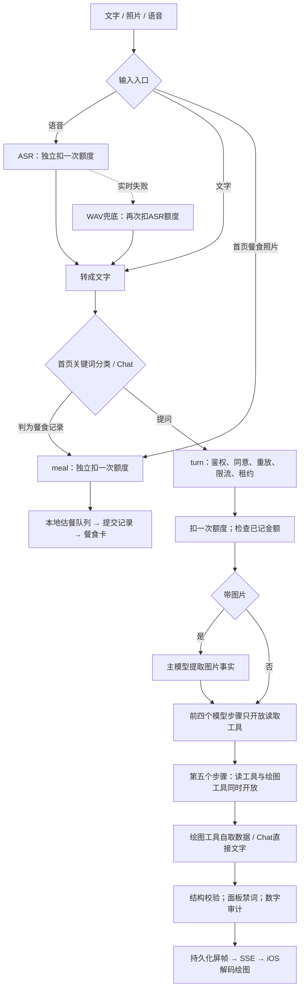
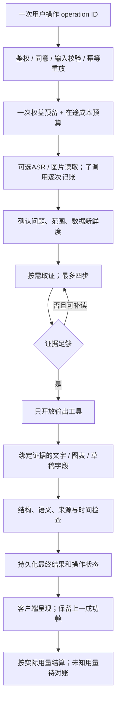

# AI 完整链路技术与产品评审

评审日期：2026-09-05。对象是当前本地工作区（含未提交改动），不是已部署版本的验收。依据 F4-server-ai、F4-ai-cost-read-draw、ADR 0005/0006/0007，以及服务端、数据库和 iOS 实现。本次不修改业务代码、不调用真实模型、不修改线上数据。这里的“表单输出”按当前产品的结构化屏帧、图表与食物卡理解；可编辑表单不是同一个能力。

结论：总体方向合理，但成本账、取证阶段和可信输出尚未闭环，不宜依据当前实现承诺“准确核算成本”“一次提问一次额度”或“每个健康数字都有对应证据”。

## 当前实际流程

上图 L 指第 5 个模型步骤。首页图片提取成功会移除读工具、直接进入绘图；Chat 图片保留读工具。普通 Chat 可在任何步骤直接以文字结束，因此不一定经过四次读取。一次 streamText 是一次 SDK 编排，不等于一次供应商请求；工具多步仍会反复发送上下文。

## 主要发现与修复方向

### 1. P1：金额账的写入权限与日期边界不成立

- `supabase/migrations/20260905110000_ai_usage_and_quota.sql:190–200` 将 `record_ai_usage` 开放给 authenticated，并接受自填日期、token、金额。普通登录用户可写自己的伪造账目；改变日期时，183–185 行直接替换金额累计，随后额度检查又按今天归零。次数限制仍在，但金额限制可以被绕过。
- 正常调用也受影响：`_shared/ai-quota.ts:76` 默认 UTC 用户日；SQL consume 使用账号 timezone 的 04:00 用户日。两者日期不同的时段，记账与准入可交替重置金额。
- 建议：记账仅由可信服务端写入，数据库决定账期；按 `(account, user_day)` 存独立日账，迟到记账只更新所属日，不改当前日桶。业务数据读取仍保持用户权限。

### 2. P1：真实 usage 没有完整进入成本账

- `model.ts` 的两个 provider 未启用 `includeUsage`。核对锁定的本地 `@ai-sdk/openai-compatible@0.2.14`：没有该设置就不发送 `stream_options.include_usage`。因此不能保证供应商返回流式用量；缺失值经 `cost.ts:57–79` 变成 0。
- SDK 将缓存命中放在 provider metadata 的 `cachedPromptTokens`；`turn/index.ts:368–370` 只读取 `part.usage`，缓存命中不会按实际元数据入账。图片对象生成路径同样只读 usage。
- 渲染成功立即 abort，usage 在 step-finish 才记录，最终步骤有漏记风险；异常、无语音等提前返回也需要对账。
- `asr/index.ts:220` 实时成功固定记零 token，成本模型没有音频秒数价格维度，语音不能据此核算。
- `cost.ts:54` 每次调用向上取整到一分。真实小额调用若为 0.1 分会记成 1 分；用这种账评估免费三年会显著失真。
- 建议：未知用量明确标为 unknown，保存原始用量与 provider metadata；金额用微元等高精度单位累计；ASR 独立记录音频时长与计价单位。最后一步不能依赖“恰好未被取消”的 usage 事件，需完整收尾或补账机制。

### 3. P1：产品的一次提问与接口的一次扣减不一致

- `consumeAiQuota` 没有逻辑操作 ID；ASR、meal、turn 各自扣一次。
- 用户语音提问先 ASR 再 turn，正常扣两次；实时失败转 WAV 可再扣一次。剩一额度时能完成转写，却无法得到回答。
- 这不是“共用一张表”能解决的问题。需明确产品计数单位：建议一次用户操作只扣一次，子调用全部记录真实成本，用共同 operation ID 串起来。
- 配套定义未调用模型、用户取消、供应商失败、结果已生成但网络丢失时是否扣次数。次数权益与实际成本应分开，不用退款次数抹掉真实费用。

### 4. P1：金额是事后阈值，尚非严格上限

- SQL 139–146 行只检查已记金额，再扣次数，没有预留在途费用。同账号多个请求可同时在阈值以下获准，随后一起超支。
- turn 每个 attempt 重新获得六步预算；主模型快失败可重试，还可进入两个 fallback。`turn/index.ts:354` 对剩余时间至少再给五秒，超时后仍可进入后续模型，因此 50 秒不是整轮的绝对截止线。
- 建议：整轮共享 deadline、供应商调用总预算和可用金额；在途预算原子预留，完成后按实结算。只对符合条件的供应商不可用错误走 fallback，不把工具、数据库、schema 故障统统当模型不可用。

### 5. P1：先读再画被实现成必须熬过四个步骤

- `_shared/turn-phase.ts:92–103` 的阶段逻辑按 stepNumber 固定开放前四步读工具，没有“证据足够，进入绘图”的显式信号。
- 简单问题第一步已读到值，下一步仍看不到绘图工具；若模型直接文字结束，面板不采集该文字，最终得到 E_SCHEMA 降级。
- 第五步同时开放读与画，与 ADR 的“绘图阶段只有画”不符。执行 gate 又按工具调用数计预算，而阶段按模型步骤计；并行调用时二者可能不同步。
- 建议：四步是上限，不是下限。以显式完成取证/请求补读信号切换，一个状态机统一管理；补读是一个可包含必要查询的阶段，禁止和 render 并发。

### 6. P1：数字出现过，不代表这句话有证据

- `ledger.ts:64–70` 把 55 等刻度常量加入全局数字集；不带强制 claim 的测量文字可以只靠数值碰巧相同通过，未绑定指标、时间、单位、来源。
- `charts.ts:180–185` 的食物宏量与预算占比由模型直接填写为数字字段；最终 audit 对 data 字符串检查，不能覆盖这些裸 number。图表点由服务器提供可以免审，模型填写的数字不能借同一规则免审。
- `turn/index.ts:445–447` 对 Chat text 完全跳过数字审计。允许普通算术是合理产品选择，但当前也放过“你昨夜 HRV 为某值”这类个人测量陈述，只剩提示词约束。
- 建议：区分 measured / derived / estimated / user-reported / general；个人健康数字强制关联 evidence ID、时间窗、单位。常量只用于坐标与尺度；模型填写的表单字段也应逐字段验证。估餐必须明确为估算。

### 7. P1：缺测在图表上被变成连续数据

- `sources.ts:204` 直接跳过空时间桶；`AIService.swift:510–525` 将 pair 取最后的数值并 compactMap，时间与空值丢失。
- `Renderers.swift:65–74` 按数组索引等距绘点，并连续 addLine。早上与晚上各一段数据，中间未戴，会被压成连续趋势。
- 建议：输出、解码和渲染全链路保留 `(timestamp, value?)`；按实际时间定位，缺测断线。双指标比较尤其需要共用时间轴，不能各自压缩。

### 8. P2：读取容量限制实际可以失效

- `tools.ts:131–138` 先 registerEvidence 全量 points，再执行 record 的 CAP60 裁剪；登记证据已把全部数值加进 ledger。
- record 只裁顶层 points，多结果数组不走该裁剪；裁到两点后也未保证 fits。账本扩大后，按全局值匹配的误放行风险更高，工具输出和后续上下文成本也不再受声明上限保证。
- 建议：先计算响应与证据预算，再原子登记最终返回证据；为多指标统一定义点数和字节/token预算，截断附 coverage 与 trimmed。完整服务端绘图点可单独保留。

### 9. P1：额度与系统故障在用户端被混成普通失败

- 首页先将 widget 替换为 thinking，收到 quota fallback 再替换成说明帧，没有保存上一帧的恢复路径（`HomeView.swift:1034` 附近）。
- Chat 遇 SSE error 返回 nil；`ChatStore.swift:173` 统一显示“现在无法回答”，HTTP quota 的具体原因与恢复时间未成为用户可见状态。
- turn 面板将 quota unavailable 也映射成 RATE_LIMITED。系统坏了会被说成额度用完。
- 本地 `dailyCap=150` 与服务端每日10/累积20并存，dailyCallsUsed 只增不按天清零；本地拦截返回 nil 时首页会重新留在 thinking。
- 建议：单一服务端额度来源；返回 remaining、reset_at 和类型化错误；保留 lastSuccessfulFrame，额度提示单独显示。Chat/语音/餐食一致区分“用完了”“网络断了”“识别失败”“数据缺失”。

### 10. P2：餐食记录与普通问答的产品边界仍脆弱

- `HomeView.swift:1100` 后仍用中英文关键词决定是否调用估餐并记录。“I had a bad night”包含 had，又不命中问题标记，会误入餐食路径；中文含“吃”也不必然表达记录意图。
- 首页餐食估算成功后自动进入记录提交链，Chat 工具则只读。相似输入在两种入口的副作用不同，需要明确反馈。
- 建议：显式“记录餐食”入口表达写入意图；普通对话有歧义时先生成草稿或澄清，用户确认后才提交。区分“建议了”“估算了”“保存成功”，不要仅靠生成出合法 JSON 判断记录成功。

### 11. P1：夜间血氧没有睡眠窗口时会退化成全天数据

- `metric-query.ts:402` 遇到没有睡眠记录直接 return，保留整个用户日的血氧样本；注册条目仍声明 overnight、clipToSleep。
- 仅有白天血氧、睡眠记录尚未同步时，模型可以得到被标为夜间、完整的白天读数。现有 `data-read.test.ts:108` 附近测试也接受这种结果，说明测试口径需要一起改。
- 建议：无法确定睡眠窗口时明确返回缺少定界证据；日间读数若需要开放，应作为另一个有准确命名的来源。

### 12. P2：tick 的 latest 与 complete 可能传达过强结论

- `data-read.ts:226–251` 超过60桶时保留最早60桶，随后对这一段计算 latest；两天半小时数据共96桶，latest 实为前30小时的最后值。
- `data-read.ts:263` 有值且未截断即可 complete，未按预期桶数或实际覆盖率判断；只测一小段也可能 complete。虽然已有 truncated 标记，但缺少实际覆盖范围与末次测量时间。
- 建议：区分“查询执行完整”与“测量覆盖完整”，单列 requested range、returned range、coverage、lastMeasuredAt；最近值从真实窗口末端计算，不从裁剪后的最早一段推断。

## 建议的目标流程

一般知识 Chat 可以跳过健康取证；个人测量陈述不能跳过证据校验。需要写入时，草稿后还有独立的授权与幂等提交步骤。所有步骤共享整轮截止时间，错误终态也要可重放。

## 验证与上线门槛

已运行 Deno 测试：turn-phase、ai-quota、cost、cost-usage、data-read、turn/index，29 passed / 0 failed。也核对了本地安装的供应商适配器源码。测试中的假流验证了部分接线，但未证明真实模型四步阶段、最终 usage、SDK 缓存元数据和客户端呈现正确。

建议优先新增行为验证：普通 JWT 不可写费用；跨用户时区和迟到 usage 不重置当日费用；语音加回答只消耗一个逻辑次数；末步 render/abort 后 usage 完整；一次读够可下一步画；并发读画不能抢跑；错误指标同值无法冒充证据；缺测图不连线；quota denied 保留旧帧并显示恢复时间。

未验证：真实模型能力、当前厂商价格和数据条款、真实照片 usage、线上迁移/函数版本、真机交互。STATUS 明确记录真实照片 usage 尚未校准，以及曾使用独立热修复部署源；本报告不把本地问题直接断言为线上事故。

推荐顺序：先修可信记账/用户日/usage，再统一逻辑操作与预算，随后修阶段状态机/证据绑定/缺测绘图，最后统一错误体验与餐食写入意图。先建立这些行为门槛，再依据真实使用分布评估三年成本。
