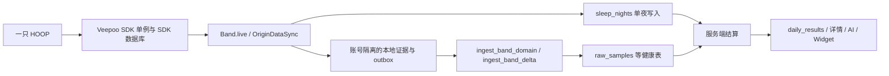
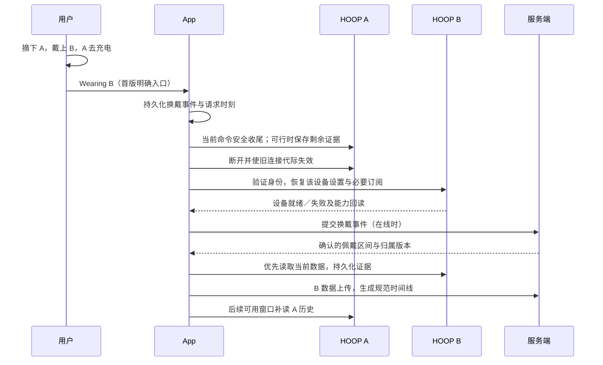
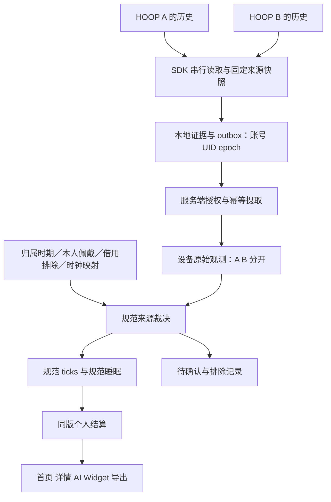

# 两只手环轮流戴，健康历史只属于一个人

`PRODUCT + TECHNICAL PROPOSAL · DUAL DEVICE CONTINUITY · 2026-09-12`

这份方案面向产品、iOS、服务端、硬件与测试团队。目标是让一个人用两只 HOOP 交替佩戴，充电时继续记录，并在手机恢复同步后得到一条可解释、可纠正的个人健康时间线。

状态：**待评审方案，未实施、未部署**。现状依据为本地 `ee37ccf3` 及审阅时的工作树；当前工作树存在其他任务的未提交改动，本次只新增本文。代码审阅覆盖与本功能有关的账号、设备、BLE、历史读取、本地持久化、云端写入、结算和展示链路；未读取闭源 SDK 内部实现，未进行双手环真机实验，也未查询生产数据库。

本文的“规定”均为建议采用的目标契约，不表示现有产品已经支持。硬件或商务条件未核实的事项以 `!` 标识，仅阻塞对应能力。本文重新打开 [ADR 0003](../adr/0003-health-account-and-band-ownership.md) 的“一账号一只、不临时共享”边界；通过评审后再更新 ADR、`CONTEXT.md` 和相关 PRD，不能把旧文档悄悄改成已实现。

## 00 · THE RULING — 同时归属，轮流传输，按时间取一份

| NO | 用户的问题 | 建议裁决 | 为什么 |
|---|---|---|---|
| R01 | 绑定 A 后是否自动绑定 B？ | 是。服务端确认 A、B 属于同一个可信设备组后，一个事务把整组归属给账号；B 未开机也被占用 | 避免 A 已属于甲、B 又被乙抢走；附近扫描到的两只设备不能自动成为一组 |
| R02 | 主设备有什么作用？ | 主设备只作默认偏好及完全同等条件下的裁决依据。另设“当前佩戴设备” | 用户换戴 B 后，B 的当前数据必须优先；永久主从关系不能压过实际佩戴 |
| R03 | 两只都开机，先读谁？ | 正在执行的用户操作优先；随后优先当前佩戴设备，给待覆盖的历史保留救援优先级，再补另一只 | 当前值要及时，旧数据也不能因主设备一直在线而饿死 |
| R04 | 两只都有数据，是否都同步？ | 在归属及同意允许的范围内，两只都读取、保存来源、独立确认；只把属于本人的有效数据放进个人时间线 | 备用设备可能保留昨天换戴前的数据；“备用”不等于“没有用” |
| R05 | 同一时间两份数据怎么处理？ | 同一指标组、同一时间支持范围，规范结果只取一个来源；不同时间拼接，合格的缺口才补齐 | 两只手环测的是同一次活动，步数、热量、睡眠不能相加，生理值也不能任意平均 |
| R06 | 能同时同步两只吗？ | 首版只允许一条活动 BLE 连接及一条原生命令；两台可同时自主记录。已落盘的 A 数据上传可与 B 的 BLE 读取重叠 | 当前 Veepoo 集成未提供可验证的多设备并发上下文；上传不依赖当前连接对象 |
| R07 | 一只给家人戴怎么办？ | 首版不支持。一套 HOOP 只记录一个人，两只的数据默认都是本人的；要给家人用，走拆组转让让它进对方的账号 | 软件没有可靠依据识别谁在戴；与其做一套"借用排除"让本人的两只表也变复杂，不如把规则说清楚：这两只只属于你 |
| R08 | 能保证完全无感、永不丢点吗？ | 提供持续佩戴和延迟补传；首版保证一次明确换戴操作可用，自动识别按已验证硬件能力开放 | 摘戴本身可能有采样空档，iOS 后台执行和手环存储也都有条件 |

“无限续航”是用户交替使用两只已充电设备的体验名称。界面使用 `Keep wearing. Charge the other.`，不显示两块电池百分比之和，不宣称后台实时同步或每秒记录必然连续。

**NOT IN V1**

| 不纳入首版 | 原因 |
|---|---|
| 一个设备组同时服务两个健康账号 | 与整组独占归属冲突；需要独立的受委托采集与隐私模型 |
| 临时借用与借用时段排除（`Pause for someone else` / `Who was wearing B?`） | 一套表只属于一个人（R07）；借用无法被软件识别，做一套排除流程只会让本人换戴变复杂。给别人用 = 转让 |
| 根据心率、HRV 或温度识别老婆／本人 | 没有可靠的身份识别依据；相似或不同都不能证明是谁 |
| 双 BLE 并行拉取、在 App 中创建两个 Veepoo 单例包装 | 当前 SDK 全局状态会相互覆盖；须厂商能力与真机实验支持 |
| 把两只设备结果做平均以提高“精度” | 未经过设备一致性与融合算法验证，可能制造不存在的数 |
| 三只及以上、自由拖动 UID 配对、任意拆组共享 | 先限制集合大小与生命周期；保修替换走受控路径 |
| 运动中的自动跨设备续接、自动同时 OTA | 会话、控制指令和恢复语义不同；先保证日常记录与换戴 |

## 01 · CODE BASELINE — 现有链路能复用什么，必须改什么

当前主链路如下。旧 PRD 的 04:00 切日、固定保留天数和同步超时不能覆盖较新的代码及 ADR；用户日遵循 [ADR 0020](../adr/0020-the-user-day-starts-at-midnight.md) 的本地午夜。



| 现状与源码证据 | 对双设备的影响 | 目标改造 |
|---|---|---|
| [核心 schema](../../supabase/migrations/20260901120000_core_schema.sql) 的 `devices_one_bound_per_user` 限制每账号一条有效归属；`devices` 同时承载归属和设备信息 | 简单再插入 B 会违反约束；现表也没有可信 UID 的全局独占约束 | 把物理设备、设备组和归属时期分开，由事务入口管理 |
| [Repository.registerDevice](../../app/NextBody/Services/Repository.swift) 只取一条有效设备；换标识会解绑旧行，且用 `deviceNumber` 判断是否同一只 | 两只同型号可能被误当成一只；第二只可能替换第一只 | 改为服务端返回的 UID／归属 ID，不由遥测写入决定归属 |
| 同一方法将 `ble_identifier_kind` 写成 `uuid`；[BoundBand / Band.live](../../app/NextBody/Services/Band/VeepooBand.swift) 只保存一个绑定标识 | 不能把当前标识直接当跨手机 UID；也不能用它承载设备集合 | 建设备目录与每部手机的 BLE 别名映射，活动连接另存 |
| [SDK 中心头文件](../../iOS_Ble_SDK/iOS_sdk_source/Framework/2.2.XX.15/VeepooBleSDK.framework/Headers/VPBleCentralManage.h) 是单例、`init` 不可用，持有一个 `peripheralModel`、一个 `peripheralManage` 和全局连接回调 | 公开契约未证明能安全并行操纵两只设备；不是在宣称 iOS 本身只能连一只 | 保留一个 SDK adapter 与一条全局命令通道，通过调度器轮换连接 |
| [SDK 设备头文件](../../iOS_Ble_SDK/iOS_sdk_source/Framework/2.2.XX.15/VeepooBleSDK.framework/Headers/VPPeripheralModel.h) 说 `deviceAddress` 验证后可能变化，未保证 `deviceNumber` 唯一 | MAC／UUID／型号编号均不能未经验证充当可信硬件身份 | 身份能力设上线门；见第 03 节 |
| [VeepooBand.readAllDataIfStale](../../app/NextBody/Services/Band/VeepooBand.swift) 一个命令读取设备保留的所有日期；当前上限 300 秒 | App 的“只处理今天”不等于 BLE 只传今天；不能承诺任意按 5 秒切换 | 按 SDK 完整命令边界调度；短读取能力另做硬件实验 |
| [HoopQueue](../../app/NextBody/Services/Band/HoopQueue.swift) 以优先级串行执行；[BandHistoryReadCache](../../app/NextBody/Services/Band/BandHistoryReadCache.swift) 有账号、绑定、连接代际 | 已有互斥与迟到回调保护基础，但建立在单绑定上 | 扩展作用域，不创建两个互不知情的队列 |
| [OriginDataSync](../../app/NextBody/Services/Band/OriginDataSync.swift) 捕获单一 binding；[BandRefreshCoordinator](../../app/NextBody/Services/Band/BandRefreshCoordinator.swift) 合并同作用域刷新 | 把 binding 改成 B 会取消 A 的会话，不能借此表示两只都绑定 | 整组刷新拆成设备子任务，每个任务固定来源 |
| [BandEvidencePublication](../../app/NextBody/Services/Band/BandEvidencePublication.swift)、[LocalDataStore](../../app/NextBody/Services/Storage/LocalDataStore.swift) 已有 durable outbox、账号隔离及服务端确认 | 可以复用“先落盘再上传”，但 sleep payload 及所有键必须补齐来源与归属时期 | 保留原始观察时间，补 UID、epoch、设备时钟和操作 ID |
| `raw_samples` 主键是 `(user_id, ts, src)`，App 两台都会写 `src='band'` | 同一时刻不能存两台的独立完整候选记录 | 新增设备观测层，现表逐步成为兼容的规范投影 |
| [观测修订迁移](../../supabase/migrations/20260906130703_band_observation_revisions.sql) 已有字段来源、原始修订与同设备新观察覆盖；会拒绝已有 domain 的不同设备来源 | 这是防污染措施，不是多设备合并器；到达先后会影响谁先占有时间点 | 保留两份候选，服务端根据佩戴与来源规则重建规范值 |
| [delta 回执迁移](../../supabase/migrations/20260909153000_band_delta_receipts.sql) 校验设备／mapper／内容，明确 oxygen、response 无完整设备来源 | 当前回执不能直接推广到双源覆盖；丢失规范竞争的一台也需要自己的回执 | 回执绑定原始观测层，不绑定当下胜出的规范值 |
| [OriginDataSync 的睡眠写入](../../app/NextBody/Services/Band/OriginDataSync.swift) 对 `sleep_nights` 使用 `(user_id,user_day)` upsert | 后读 B 可能重写 A 的整夜，无法保留半夜换戴两段 | 先写每设备睡眠证据，再服务端生成唯一规范夜 |
| [RLS](../../supabase/migrations/20260901120100_rls.sql) 允许用户插入／更新自己的 devices 行；ingest 校验账号、同意及 payload，未建立可信 UID 归属校验 | 已有账号行隔离不等于整组硬件独占；受影响动作是绑定、换绑和提交设备数据 | 收口所有归属写入口与全部设备数据写入口，旧客户端也不能绕过 |
| [DataStore](../../app/NextBody/Services/DataStore.swift)、[BandPresence](../../app/NextBody/Services/Band/BandPresence.swift) 只有一份当前 band；电池日志已有账号＋binding 作用域 | 展示模型、电池曲线、最后同步时间、找设备与控制目标都要明确到 UID | 个人健康聚合与设备遥测分开缓存，设备页显示两张独立设备卡 |
| [BackgroundRefreshPolicy](../../app/NextBody/Services/Band/BackgroundRefreshPolicy.swift) 仅在有 Widget 等条件下请求后台拉取；[ADR 0028](../adr/0028-a-day-settles-in-seconds.md) 正在控制结算预算 | 不能假定后台自动轮询两只；也不能把每台每批都变成一次完整重算 | 保留后台预算，合并 dirty 区间，按个人规范修订结算 |

另有 [设备注册名单计划](2026-09-06-registered-device-address.md)，但本次未在实现中找到该计划描述的注册名单门禁。该计划自身也标为未实现；其中“MAC 足以作为硬件身份”的判断不能替代设备真实性验证，本方案不继承这一假设。

## 02 · VOCABULARY — 四种身份不能混在一起

| 概念 | 字段建议 | 含义与寿命 |
|---|---|---|
| 健康账号 | `user_id` | 个人健康历史的主体，沿用已有已验证登录身份 |
| 物理设备 | `device_uid` | 一只真实手环的稳定实体身份；跨手机、重启、解绑保持，不是数据库行 ID |
| BLE 别名 | `installation_id + peripheral_identifier` | 该手机发现／重连设备使用的地址线索，验证后映射到 UID，不决定所有权 |
| 设备组 | `set_id` | 当前一起交替使用的设备集合；升级中的账号可有 1 只，双设备组为 2 只 |
| 组成员时期 | `membership_id + [valid_from, valid_to)` | A 与 B 在哪段时间属于这一组；保修替换不重写过去 |
| 手环归属时期 | `ownership_epoch` | 某 UID 在一段时间被授权归属于一个账号；转让／重新领取开启新时期 |
| 主设备 | `preferred_device_uid` | 用户长期偏好；无有效佩戴信息时才用于默认选择和同等候选裁决 |
| 当前佩戴设备 | `wear_assignment` | 某段时间本人选择或系统有足够证据判定戴的设备，可为空；变化有历史 |
| 当前连接设备 | `transport_device_uid` | 手机此刻正在操作的设备；为补历史连 B 不会把本人从 A 改成 B |
| 槽位 | `slot` = `A` / `B` | 设备组内的固定位置，激活时定下，换戴与偏好都不改；只用于界面称呼 HOOP A / HOOP B 和遥测里的 device slot，不承载归属 |
| 数据归属裁决 | `attribution_status` | `self_confirmed / self_inferred / unresolved / excluded_other / excluded_unknown`，说明候选能否进入本人时间线 |
| 规范时间线 | `canonical` | 同一人的同一指标组、同一时间只保留一个有效来源的计算输入；能够追到原始观测和裁决版本 |

不在 UI 中称 B 为“从设备”，也不印 `PRIMARY / STANDBY`。显示 `HOOP A / HOOP B` 与 `Wearing / Ready / Charging / Away / Paused`；设备页两张设备卡顶上的 34pt 槽条印这些词，石灰卡永远是当前佩戴设备，主设备偏好只在次级设置里出现（`Preferred HOOP · A`）。

## 03 · OWNERSHIP — 两个 UID 在一个事务中归属同一个账号

### 03.1 设备组从哪里来

推荐默认是**出厂或履约时建立可信组关系**：服务端设备目录记录 A、B 及组版本。首次领取 A 时，根据可信组记录找到 B；用户不能自行提交任意 `peer_uid` 来占用别人的设备。若销售方式是两只单品自由组合，需要两只均完成实物持有证明的组建流程，不能只输入第二个 UID。

`!` 待确认：当前供应链能否提供真实 UID、UID 与设备真实性的校验机制、出厂组清单。如果没有预建组或对 B 的独立持有证明，“只见到 A 就自动绑定某个 B”没有可信依据，不开放该入口。

| 身份层 | 可以证明什么 | 不能据此承诺什么 |
|---|---|---|
| 手机 BLE UUID | 这部手机曾见过的外设 | 跨手机唯一、不可伪造、属于某账号 |
| 验证后地址／MAC | 经真机核实后可成为设备目录的别名 | MAC 字符串或白名单自身不证明实物持有，也不能阻止第三方 BLE 读取 |
| 厂商 UID＋可信持有证明 | 设备目录定位与领取授权；具体强度取决于实现 | 没有固件或密码学契约时不能称为不可克隆 |
| 服务端整组事务约束 | NextBody 账号体系内一组只归一个账号 | 不等于阻止手机系统蓝牙配对或第三方 App 连接 |

建议优先使用设备对服务端短时随机挑战的签名／认证响应；若硬件不支持，由厂商确认的实物确认机制、不可枚举领取秘密和销售归属联合完成降级方案。**这些都是待验证能力，不是当前 SDK 已有接口。** `0000` 验证成功只意味着 SDK 通信就绪，不能替代领取授权。低强度方案必须缩小产品承诺，不能仅把 UUID 改名为 UID。

### 03.2 必须由数据库保证的约束

| 约束 | 服务端规则 | 原因 |
|---|---|---|
| UID 唯一 | 全局设备目录唯一 `device_uid`；UID 正规化只接受厂商定义格式 | 防止大小写、别名绕过 |
| 归属独占 | 同一个 UID 的有效归属时间区间不能重叠 | 保护跨账号独占和历史分界 |
| 组成员独占 | 同一 UID 同时最多属于一个有效设备组 | 禁止 A–B 与 B–C 同时存在 |
| 账号容量 | 同一账号只有一个有效组，成员 1–2 只；激活双设备功能必须达到两只可信成员 | 支持旧用户升级与保修降级，不无限扩容 |
| 整组领取 | A、B 的归属共同提交或共同回滚 | 不允许“配对成功但只绑了一半” |
| 主设备合法 | 偏好 UID 必须是本组有效成员；修改只影响生效时刻之后 | 不让偏好变更改写历史 |
| 修改有版本 | `expected_set_version` 乐观并发校验；转让再校验 `ownership_epoch` | 两部手机的旧页面不能覆盖新归属 |
| 无客户端直接写 | 客户端不能直写成员、归属、撤销、主设备或目录，统一走受控 RPC | 仅在前端禁用按钮挡不住旧版本和自造请求 |

实现用账号／组行锁与 UID 有序锁，所有领取、拆组、替换、转让沿同一锁顺序；数据库唯一／区间排斥约束作最终兜底。容量与整组一致性需事务函数及延迟校验，不能只靠“先 SELECT，再 INSERT”。授权判断使用认证上下文，不接受请求体里的 `user_id` 作为身份。

### 03.3 首次领取与第二只激活

1. 用户登录并同意健康数据处理，发现 A，完成 SDK 验证和可信实物验证。到这里还不能读取健康历史或推送个人资料。
2. App 提交 A 的证明、领取操作 ID；服务端核对设备、组版本、注册／撤销状态和整组可领取性。
3. 服务端在单事务中创建 A、B 的归属时期，设置 A 为初始偏好，返回组快照和各设备授权状态。若 B 已属于别人，整笔拒绝；不泄露对方身份。
4. A 进入 `activated`。B 进入 `owned_pending_activation`：**已经归本账号，不能被别人领取，但尚未授权导入旧数据**。B 不在现场不会阻塞 A 使用。
5. 用户第一次拿到 B 时完成该设备实物验证、能力读取、个人资料与测量设置回读。界面展示 B 已在组内，无需再次绑定账号。这个激活入口只在设备页的 B 槽卡上（可信套装时槽条印 `B · YOURS · ADD WHEN NEARBY`，自由组合时印 `B · EMPTY · TAP TO PAIR`）；Onboarding 只完成 A，配对成功屏只留一句 `Keep wearing. Charge the other.` 的提示，不在 Onboarding 里绑 B。
6. 首次导入每只设备只接收已证明属于本人归属期的记录。默认从该设备的首次使用确认时刻开始；出厂测试数据、领取前历史不自动导入。离线首次佩戴等早于确认的时段，须单独确认本人使用时间且具备可信时钟映射；无法建立分界的记录隔离。

网络在提交后断开：以同一个 `client_op_id` 查询／重试得到同一结果；不能新建另一个组。客户端只有收到服务端已提交快照，才显示整组归属成功。B 未激活、离线、未同步均不代表 B 未被占用。

### 03.4 归属、退出、断开与释放

| 动作 | 结果 |
|---|---|
| App 断开蓝牙／本机移除连接 | 只停止该安装的传输；不释放 A 或 B 的云端归属 |
| 退出账号 | 取消旧账号命令、关闭订阅、隔离本地数据；整组仍归原账号 |
| 改主设备／日常换戴 | 只变更偏好或佩戴时段；不新建归属时期 |
| 解除整组归属 | 明确显示 A、B 都会释放；服务端原子关闭两个归属时期，撤销后续设备访问；历史保留原账号 |
| 单只转让或保修替换 | 专用流程改变成员和归属时期；不复用含义模糊的 `Forget this HOOP`。设备页 CONNECTION 组首版只有 `Disconnect` / `Release both HOOPs` / `Replace or hand one over`（首版走 support），不再有 `Forget HOOP A / B` |

## 04 · WEARING — 换戴是时间事件，不是蓝牙连上了谁

### 04.1 A 换 B 的标准流程



A 最后一批数据不应成为用户戴上 B 的前提；B 开始自主采样也不依赖 A 上传成功。实际佩戴事件、B 连接成功、B 数据到云是三个独立状态。即使 B 连不上，用户确实戴着 B 的声明也保留，显示 `Wearing B · Not connected`，不能因为连接失败自动把佩戴事实改回 A。

界面上这三个状态各有位置：用户按下 `I'm wearing B` 的那一刻石灰就从 A 卡移到 B 卡（wear assignment 已改），B 卡槽条先印 `B · WEARING · CONNECTING…`，连上后改 `· ON WRIST`；A 卡同时退成碳黑，槽条印 `A · SWITCHED OUT · WILL SYNC WHEN NEARBY`，它的历史在之后的可用窗口补读。顶栏 `CONNECTED · A / B` 只反映传输设备，与槽条可以短暂不一致，这不是错误。

佩戴切点 `t_switch` 由用户当前确认或可验证的历史事件决定，记录 `effective_at` 与 `recorded_at`。如果用户 10:00 才打开 App，并确认 08:00 已换戴，不能一律把 10:00 当作采样切点。回填必须有限范围、保留理由和时钟置信度，归属边界外不可回填；不确定区间标 `unresolved`。

### 04.2 自动换戴分三层交付

| 层级 | 触发与证据 | 行为 |
|---|---|---|
| 首版确定能力 | 用户按 `Wearing B`，或明确选择历史起点 | 立即记录意图；在命令安全边界切连接；无需重新配对 |
| 前台辅助发现 | 发现本组另一只，用户尚未声明，旧设备有可靠充电／离腕证据 | 提示 `Wearing B now?`（画板 `A·P3`：A 槽条 `WEARING · ON CHARGER?`，B 槽条 `NEARBY · WEARING B NOW?`，WEARING 组第一行变成 `Wearing B now? · YES`）；仅 RSSI 更强或 A 断连，不自动换戴 |
| 后续自动与历史识别 | 已验证固件提供足够的佩戴／充电时段证据；本人已开启两只仅本人使用，目标设备已激活，且无借用／归属冲突 | 按版本化规则形成 `self_inferred` 区间；证据不足保留待确认，允许纠正 |

App 未运行时不能声称实时检测完成。两台自主记录能力成立时，可在下次拉取后识别历史换戴、补齐时间线。若当前固件没有可靠历史佩戴状态，至少保留明确换戴入口；是否承诺“完全不用打开 App”是依赖硬件实验的独立准入条件。

### 04.3 佩戴归属证据的优先级

一套表只记录一个人（R07），所以这里要裁决的不是“谁在戴”，而是“我戴的是哪一只”。先应用归属时期（转让前后）、同意与撤销，再按下面的顺序决定一段记录用哪只：

1. 用户对时间段的明确声明优先（`I'm wearing B`、事后补的 `since 08:00`、冲突时选的 `HOOP A / HOOP B`）。改声明是新的修订，不被后续自动同步覆盖。
2. 没有声明时，以经验证的设备离腕、上腕、充电与不重叠有效记录推断；保留证据和规则版本。
3. 两只在同一时段都有有效记录（换戴时短暂重叠、或忘了摘下另一只）：已有本人声明的那只继续用；没有声明就问一次 `Which HOOP were you wearing?`，答 `Not sure` 沿用上一段已确认的来源。两份都是本人的，只是同一 tick 只取一份，不是把另一只当外人。
4. 心率相似度、运动相关性、距离、RSSI、手机在附近均只能提示排查，不单独决定来源。

家人戴了其中一只而没告诉 App，数据会算给本人，软件识别不了——这是接受 R07 的代价，必须在评审里明说，初次启用时告诉用户“这两只只属于你；要给别人用，先转让”。

### 04.4 稳定性规则

自动切换不得在两只 RSSI 之间来回抖动。只有新的可信佩戴证据才改变 assignment，电量和连接信号只改变传输计划。去抖窗口、历史佩戴检测时间精度与误判率必须在真机实验后确定；未定阈值不开自动开关。

### 04.5 手动为主的边界清单（评审补充 2026-09-13）

首版把"手动"当硬约束，用一条规则替代 §07 的多层裁决：**规范来源 = 佩戴声明**。用户按 `I'm wearing B` 的那一刻 `t_switch`（可事后改），B 的数据从 `t_switch` 起进时间线，A 的数据到 `t_switch` 为止；两只各自照常记录、各自上传原始观测（§06 不变），但同一 tick 只取声明区间里的那只，**没有第二条选源规则**。时间线上任何一刻只有一个声明区间，所以"两只同时有效"的冲突在首版不会发生；唯一的问题是跨切点的那一个 tick，按半开区间 `[t_switch, …)` 归 B。§07.1 的质量档、同档裁决、沿用上一来源只保留给 S3 自动换戴。

数据传输在首版只有两种动作：**戴着的那只**照今天的节奏同步（前台 5 分钟一次、SYNC 键、回前台 resume）；**另一只**在设备页的卡上有自己的 `SYNC` 键，用户点了才去读——读的时候戴着的那只断链一到几分钟，卡上明写 `SYNCING A · B PAUSED`。App 不在两只之间自动来回切链路；自动补读放到 S3，且只在"戴着的那只 10 分钟内读过、另一只在附近、没有测量／运动／OTA 在跑"时做一次，做不到就不做。

#### 首次连接

| 编号 | 场景 | 处理 |
|---|---|---|
| F1 | Onboarding 只绑 A | 与现状一致：A 进 `activated`，佩戴声明从绑定时刻起算 A。成功屏一句 `Keep wearing. Charge the other.` |
| F2 | 在设备页激活 B，A 正连着 | S1–S4 期间 A 的链路让出给 B 做验证、能力与电量读取，**不读 B 的历史**；S4 结束后重连 A。A 的自动同步用独占标记挡住，不会中途抢链路 |
| F3 | 激活 B 时 A 不在场／没电 | 一样走 S1–S4；结束后重连目标仍是 A（声明没变），A 不在就显示 `AWAY` |
| F4 | 激活时用户其实已经戴着 B | S4 底部除了 `DONE` 再给一行 `I'm wearing B now`；点了就等于 S4 + 一次换戴声明，`t_switch` = 现在 |
| F5 | B 在激活前已经记了几天（曾经用过、出厂测试） | 激活前的历史不进时间线（§03.3 步骤 6）；`t_switch` 最早只能回溯到激活时刻 |
| F6 | 扫到的"第二只"其实就是 A | S2 里按服务端组快照置灰 `ALREADY IN SLOT A`，不能选 |
| F7 | 激活中途失败（没找到、被别人占用、认证超时） | S5／S6；槽位不写，A 照常。重试从 S1 开始，不留半激活 |
| F8 | 两槽都满还想加第三只 | 空槽不存在，没有入口；换表走 `Replace or hand one over`（support） |

#### 换戴（手动）

| 编号 | 场景 | 处理 |
|---|---|---|
| W1 | 点 B 的卡片 → 确认 `Switch to HOOP B?`，两只都在附近，A 空闲 | 声明先落盘（`t_switch` = 点击时刻，标 `auto`）→ A 断开 → 连 B → 读 B → **起点自动前移**（见 W1b）→ A 转 `SWITCHED OUT · WILL SYNC WHEN NEARBY`，A 卡出现 `SYNC` 键和 `PENDING n DAYS`。面板不选设备（只有两只，点哪张卡就是选哪只）、不选时间 |
| W2 | 按的时候 A 正在读历史（`readAllData` 最长 300 s） | 声明立即落盘，石灰立即移到 B；A 卡印 `FINISHING A · THEN B`，等这条命令终态再断开。没有 stop API 就不硬中止；被中止的域记 `partial`，不推进游标 |
| W3 | 按的时候 B 不在附近／没电 | 声明仍成立，B 卡 `WEARING · NOT CONNECTED`，重连目标改成 B；回前台或 B 出现时自动连。**不因连不上改回 A** |
| W1b | 起点由证据定（`settle_wear_start`） | 手机读完 B 之后，服务端从 `t_switch` 往回走 B 自己「有脉搏」的 tick：断档 > 45 分钟即止，最多回溯 24 小时，不越过更早的声明。同段时间里 A 必须是静的（A 的有脉搏 tick ≤ max(2, B 的 1/5)）才前移；两只都亮着就不猜，留在点击时刻。前移后重投这段的归属，设备页印 `Counted from 08:30` |
| W4 | 事后补时间（10:00 打开 App，说 08:00 就换了） | 正常不需要：W1b 会自己找到 08:30。要覆盖它就点 `Counted from …` 那行，指定的时间标 `manual`，`settle_wear_start` 永不再动它。可回溯的最早时刻 = B 的激活时刻 |
| W5 | 一分钟内按了 A→B→A | 每次都是新声明，最后一次有效；中间那段不足一个 tick 的区间按半开区间自然归并，不留碎片 |
| W6 | A 上有运动会话在跑 | 拒绝并说明 `End the workout first`；不自动结束运动、不跨设备续接（§14） |
| W7 | A 或 B 正在 OTA | 拒绝换戴直到 OTA 终态；卡上印 `UPDATING · 62%` |
| W8 | 正在做身体扫描／平衡检查 | 等测量终态；测量记录固定在发起时的那只 |
| W9 | 按 `I'm wearing B` 但 B 最近一次读到的状态是"在充电" | 软提示 `B looked like it was on the charger 20 min ago. Wearing it anyway?`，可继续；不阻断 |
| W10 | 切点落在一个 5 分钟 tick 中间 | 该 tick 归 `t_switch` 所在半开区间的那只，不按比例拆分、不相加（§07.3） |
| W11 | 半夜换戴 | 同一夜的两段原生睡眠片段按声明区间各取各的，中间没测到的分钟是 unknown（§08）；只有整夜总量、没有分期的固件，这一夜取佩戴时长更长的那只 |
| W12 | 忘了按，第二天才发现 | 先按 W1 切过去；W1b 只回溯 24 小时，更早的那段用 `Counted from …` 补一次带时间的声明（W4）。A 那段本来会被算成"戴着但没数据"的空档由 B 补上 |

#### 数据传输

| 编号 | 场景 | 处理 |
|---|---|---|
| D1 | 戴着的那只 | 与现状完全一致；`SYNCED` 格、后台拉取、Widget 都只看它 |
| D2 | 另一只的补读 | 用户在它的卡上按 `SYNC`：戴着的那只断链 → 连它 → `readAllData` → 断开 → 重连戴着的那只。两张卡同时印状态：`SYNCING A · 3 OF 7 DAYS` / `B PAUSED · BACK IN A MINUTE`。中途退出 App 不取消，读完为止 |
| D3 | 另一只的待读天数逼近固件保留上限（saveDays） | 卡上印 `PENDING 6 DAYS · SYNC BEFORE FRI`；超过就是 `SOME DATA IS UNAVAILABLE`，留缺口不填零 |
| D4 | 两只都有待读（手机离开一周） | 先戴着的那只，再等用户按另一只的 `SYNC`；不自动排队 |
| D5 | 补读时戴着的那只来了新数据 | 它自己留着，补读结束重连后按现状读回；这一分钟的实时心率流本来就不在 |
| D6 | 上传失败／离线 | 现有 outbox；两只各自的回执，互不阻塞（§05.4） |
| D7 | 另一只上传的数据落在它的声明区间之外 | 照常上传进原始观测层，**不进时间线**；日后补时间（W4）时不用再读一次表 |
| D8 | 同一只被两部手机各读一次 | 现有幂等；不翻倍 |
| D9 | 补读结束后重连戴着的那只失败 | 卡上印 `RECONNECTING`，走现有重连；数据不受影响 |
| D10 | 用户在补读中按了 `I'm wearing A` | 声明照记；补读命令跑到终态再按新目标重连，中间不硬切 |

#### 断开与释放

| 编号 | 场景 | 处理 |
|---|---|---|
| X1 | `Disconnect`（本机链路） | 两只都继续记录，声明不变；再连的目标是戴着的那只 |
| X2 | 链路自己掉了（出范围、蓝牙关了） | 与现状一致；重连目标 = 戴着的那只，不是"上次连的那只" |
| X3 | 戴着的那只没电 | 它停止记录，声明不自动改；用户按 `I'm wearing B`，A 剩下的数据充上电、在附近时按 `SYNC` 补 |
| X4 | 另一只没电／关机数天 | 卡印 `AWAY · LAST SEEN …`；待读天数继续累计到保留上限 |
| X5 | `Release both HOOPs` | 服务端一个事务关闭两个归属时期，声明区间在释放时刻封口；历史留原账号 |
| X6 | 退出账号 | 与现状一致，两只的本地证据按账号隔离；声明存在服务端 |
| X7 | 换手机／重装 | 从服务端恢复组、声明区间和两只的槽位；分别重建 BLE 别名，先连戴着的那只 |
| X8 | 两部手机同时用 | 声明走服务端 CAS（§11.2）；哪部手机连着哪只由各自的租约管，不影响声明 |
| X9 | 恢复出厂／换 UUID | 归属不变（§14）；重新验证后回到原槽位 |

上面所有"卡上印 …"都是槽条或胶囊的变体，不新增页面；S3 的自动换戴一旦证据达标，只是把 W1 里"用户按"换成"App 预填、用户确认"，其余行不变。

## 05 · TRANSPORT — 一条蓝牙通道，两份独立进度

### 05.1 分层并发契约

| 层 | 首版并发数与隔离 | 说明 |
|---|---|---|
| 手环自主采集 | 两只可分别工作，须实测离线采集和设置保持 | 与 App 连接数无关 |
| App 到 SDK 的活动连接 | 最多 1 只 | 同一个 adapter 负责断开 A、验证 B；不把“两个 adapter”当两套 SDK |
| SDK 业务命令 | 全局最多 1 条 | 读取、测量、配置、寻找与 OTA 共用互斥；stop 走已定义的终止通道 |
| 本地解析 | 只处理已完成、带来源的不可变快照；离开 SDK 全局 DB 后可并行 | 查询 SDK 数据库仍要捕获验证后 tableID 与连接代际 |
| 网络上传 | 建议最多 2 个请求；同一 UID／epoch／domain 有序 | A 已落盘上传可与 B 读取同时进行；限额为实现初值，压测后调整 |
| 服务端摄取 | 可并发接收，各批幂等；锁顺序一致 | 不能让到达顺序决定规范来源 |
| 个人结算 | 按账号与输入修订有序、可续算 | A、B 共同形成一次个人结果，不做 A 一份、B 一份再相加 |

### 05.2 调度优先级与公平性

| 顺序 | 工作 | 选择依据 |
|---|---|---|
| P0 | 停止／安全收尾、已在进行的主动测量、运动控制、OTA 生命周期 | 已在飞的不可打断命令先结束；身份失效要终止访问 |
| P1 | 用户明确换戴与前台必要设备操作 | 在安全边界立即执行；不得等另一只全部历史上传完 |
| P2 | 即将被覆盖的未保存历史 | 使用每设备、每数据域实际容量与最旧待取记录计算 deadline；仅在存在可信风险时抢在常规拉取前 |
| P3 | 当前佩戴设备的新数据 | 优先获得当前值；没有可信 wear assignment 时选有证据且需要同步的设备，仍不自动决定数据归属 |
| P4 | 换下设备的未确认数据、前一夜和失败修复 | 修补换戴前后时间线；可达且有待办时，一个整组刷新不能一直只处理主设备 |
| P5 | 更旧的历史审计、非紧急遥测 | 同优先级先选等待更久者，再考虑已有连接、低切换成本，最后才是主设备偏好 |

公平性约束：在前台两只都可达、没有 P0/P1 独占、均有待办的连续执行窗口内，一只完成一个可完成的历史域命令后，另一只必须获得一次调度资格；已有覆盖危机按 deadline 排序。持续用户操作或 iOS 时间耗尽时可以延期，但必须记录 `deferred_reason`，不能静默将 B 标为完成。

“即将覆盖”不能简单等于 `saveDays - last_synced_days`。要同时考虑是否已安全进入 App outbox、设备是否在采集、数据域不同容量、环形缓冲实际规则和时钟。只缺云端 ACK、但本机已可靠落盘的数据，不再与尚留在手环上的数据争抢 BLE 救援优先级。

### 05.3 SDK 粒度决定可以在哪儿切换

当前 `readAllData` 是全历史命令，结束后才有可信完整快照。日偏移是后续数据库查询／App 处理范围，不能作为 BLE 分片边界。现有 300 秒 deadline 也不是体验目标。

换戴请求遇到正在执行的历史读取时：保留请求，等该命令终态；确需硬中止时，由 adapter 显式断开、清理旧订阅、推进 generation，再连接目标设备。被中止的域记 `partial/failed`，不能推进完成游标。无 stop API 时不允许“取消 Swift Task 后立即发 B 的指令”冒充安全中止。硬中止后的 SDK 数据库是否保留局部页必须实测；未有完整性证明的页不发 complete 回执。

测量和 OTA 开始前把目标 UID 固定下来。找 A 就只振动 A；用户改成佩戴 B 不会把尚未执行的“找 A”变成“找 B”。队列在执行前再次验证目标、账号、epoch、能力版本，失败返回 `TARGET_CHANGED / OWNERSHIP_CHANGED / DEVICE_BUSY`，不悄悄改目标。

### 05.4 同步一次的成功标准

每个子任务分别记录 `device_read → locally_durable → cloud_acked → canonical_resolved → calculated`。这五个阶段不能压成一个 `isSynced`。

| 状态 | 对用户的含义 |
|---|---|
| A 已同步，B 不在附近 | A 的数据可用；B 显示上次连接和 `Will sync when nearby` |
| 两只读取完成，网络离线 | `Saved on this phone`；不能更新云端已同步时刻 |
| 两只上传完成，部分归属不明 | `Data needs review`；上传成功不代表都进入本人指标 |
| 数据已确认、结算进行中 | 保持上版带时间的数，显示更新状态；不画 B 的原始总数替代 |
| 部分数据永久被设备覆盖且无本地副本 | `Some data is unavailable`，保留具体缺口；继续后续日期 |

个人首页新鲜度来自规范数据的最后有效采样及计算修订，不取“两只最后同步时刻的最大值”或强制取最小值。今天只戴 A 时，B 昨天未同步不应把 A 的当前心率判为过期；若 B 覆盖本人昨晚缺失时段，则显示该缺口尚待同步。

## 06 · DATA MODEL — 原始候选先各自保留，再发布一条个人时间线



### 06.1 原始观测与规范投影的边界

新增设备观测层，而不是仅将 `raw_samples` 主键加一个 `device_id`。现有 SQL 大量按个人时间读取；直接扩大原表会令已有 SUM、睡眠、训练与身体电量重复消费两份记录。

建议保留 `raw_samples`、`oxygen_samples`、`response_samples`、`sleep_nights` 的个人读取契约，逐步让它们成为服务端发布的规范投影；原始 A、B 候选进入新的带来源表。所有下游读取必须最终只见规范投影。迁移期间投影模式与旧 ingest 必须按账号互斥，不能两套写者同时更新同一行。

每份观测包含：

| 字段组 | 必要字段 | 用途 |
|---|---|---|
| 身份 | 服务端导出的 `user_id`、`device_uid`、`ownership_epoch`、采集时 `membership_id` | 区分同账号两只与同设备前后两位主人；迟到数据不受当前组成员变化误伤 |
| 时间 | 原始设备时间／日期、`sample_start/end` 或 instant、`sampled_tz`、`clock_epoch`、映射版本及误差范围 | 防跨时区、回拨、重启后重号与错误对齐 |
| 观察与传输 | `observed_at`、`read_started_at`、`read_completed_at`、`received_at`、来源安装、连接代际 | 区分采样时刻、SDK 观察时刻与云端到达时刻 |
| 数据语义 | `domain`、指标单位、支持区间、`firmware_version`、`mapping_version`、能力／个人资料版本 | 分清五分钟累计、瞬时值和整夜汇总，识别设备能力差异 |
| 幂等与修订 | 原生序号／记录键（若有）、`logical_record_key`、`content_hash`、`observation_id`、修订关系 | 重复上传不重复记账，设备修订仍可覆盖其自身旧观察 |
| 质量 | `validity`、厂商状态、佩戴证据、时钟置信度、采集完整性 | `unknown` 不冒充高质量，非法值不参与比较 |

原始证据不可被规范裁决覆盖；更正／撤回写新版本及 tombstone。这里的“保留”受同意、保留期和删除要求约束，不是永久留存。已明确属于家人的时段默认在本地过滤，不上传其健康数值；若误传后被纠正，按第 09 节清除并留最少审计信息。

### 06.2 幂等与同设备修订

逻辑记录键优先用厂商稳定序号：`device_uid + ownership_epoch + domain + clock_epoch + native_record_id`。若没有，则使用厂商可证明稳定的设备原始日期／时段／块索引；只有 HH:mm 而又无法区分回拨重复时刻的两段记录，不伪造唯一性，保留原始快照并隔离歧义。

同一逻辑记录、同一内容只保存一次实质观测；相同值的再次观察可记录更晚观察时钟，以保留现有防迟到覆盖语义。相同逻辑记录内容不同，只有可比较且更晚的原生修订／实际 SDK 观察才能推进版本；同一观察时刻却内容不同视为冲突，不按手机上传时间“最后写入胜出”。不同映射版本不能按字符串大小判新旧，必须由发布的升级策略决定。

`delta receipt` 至少绑定账号、UID、epoch、domain、记录键、mapper、内容哈希和回执版本。回执指向原始观测，即使这条记录未在规范层胜出，也可以确认已保存。引用失效时请求 full payload，不把另一只同值样本当作缓存命中；被删除／排除后的回执不得复活记录。

## 07 · CANONICAL RULES — 数据补齐必须先过身份，再过质量

> 首版（S2）只用 §04.5 的一条规则：规范来源 = 佩戴声明区间。本节其余的质量档、同档裁决、沿用上一来源，是 S3 自动换戴引入推断区间之后才需要的。

### 07.1 确定性裁决顺序

对个人的指标组 `g` 和一个时间单元 `w`，按以下顺序计算候选 `E(g,w)`：

1. 验证 UID 归属时期、同意、撤销、借用排除与采样时间归属。`unresolved` 与他人数据不进入 `E`。
2. 应用设备自身的有效修订，保留可解释时间映射；丢弃未佩戴无效值、缺失码、损坏和不可比数据。数值为 0 只有在指标本来允许且有效性已证明时才是 0。
3. 按完整来源区间确定该时间单元的主采样来源；明确本人佩戴优先于推断本人佩戴。已经明确选择本人 A 的区间，B 身份未确认时，B 不能因 A 的某字段缺失而补入。
4. 在**两只均已确认本人佩戴**的重叠区间，对该指标组比较已验证的质量档、完整性和时间置信度；质量较差的指定来源可降级到另一只，但记录原因。
5. 质量同档时，采用该时段的明确来源偏好／当前佩戴 assignment；再沿用连续的上一来源；仍相同时用生效于该时段的主设备偏好，最后用固定 UID 顺序兜底。这个顺序不使用上传先后、数值大小或谁的分数更好。
6. 输出一个来源或空值，并保存候选引用、胜出原因、`selection_policy_version`、`assignment_revision`、`clock_mapping_revision` 和 `canonical_revision`。

只有一个已获准候选时使用它；没有候选时留空。后到数据可触发有理由的修订，但调换 A→B／B→A 上传顺序，在相同证据与政策下最终结果必须相同。

“沿用上一来源”指按采样时间顺序重放后的上一规范区间，不是上一条到达服务器的记录。区间中途开始重算时读取已确认的前置来源与版本；更早证据改变该前置状态时，继续向后重算直到状态收敛，保证分批计算与整段计算一致。

质量等级不能凭空从算法感觉生成。首版只有经过定义的 `valid / invalid / unknown` 和真实支持区间；更细的信号质量排名需要厂商状态字段和实验。如果固件没有可比质量分，就执行确定性来源规则，不能用“取最大步数”“取正常心率”冒充质量判断。

### 07.2 不同指标的合并单位

| 指标／域 | 规范规则 | 禁止与原因 |
|---|---|---|
| 步数、距离、MET、厂商耗卡及同一 origin 的相关字段 | 同一五分钟支持区间选同一 origin 快照；不重叠区间可求和／按原算法使用 | 同区间 A+B 会翻倍；A 步数＋B 距离＋择大 MET 会形成不存在的运动 |
| 心率、压力等 origin 中的字段 | 首版跟随 origin 来源；只在独立指标流有明确时间、有效性和裁决契约时独立选源 | 不以逐字段“哪个有就拿哪个”破坏同刻计算一致性 |
| 温度、HRV、血氧、RESPONSE 等独立域 | 各域按实际采样支持区间裁决；允许在两只都获准属于本人的前提下补独立域缺口 | 不因 A 不支持某能力就自动接纳 B 的身份未知记录；不平均不同校准的值 |
| RR 与由其计算的 RMSSD | 一个连续 RR 片段只用一只设备；保留真实索引／缺口，跨设备换源切断相邻关系 | A 最后一拍与 B 第一拍不是连续 RR，不能人为制造差值 |
| 主动身体扫描、平衡检查及测量记录 | 每次测量独立事件，保留 UID、操作者确认、输入体重与个人资料版本 | 不把同时测量去重成一个平均结果，不允许选错设备后套用本人资料 |
| 运动会话 | 首版活动会话锁定设备；明确结束 A 后可在 B 开新段，并可在展示层关联一次活动 | 不自动把两只 sport 累计总量相加；现有日级训练也不是 sport 会话表 |
| 电池、充电、固件、能力与闹钟状态 | 永远按设备独立保存展示 | 两只 80% 不等于 160%；电池趋势不应因换戴接成一条曲线 |
| 训练负荷、活动热量、身体电量、睡眠分、日方向 | 仅从规范证据按已有产品算法重新结算 | 不合并两个设备各自算出的日分或累计量；厂商耗卡不与产品活动热量相加 |

### 07.3 五分钟 tick 中途换戴

必须保存原始支持区间，不能把所有时间相差不足五分钟的点直接去重。示例：A 的记录代表 `[10:00,10:05)`，B 的记录也代表该区间，用户在 10:02 换戴。

如果固件提供真实分钟／更细增量，可以在统一边界裁剪并聚合不重叠部分。如果只有五分钟汇总，则无法准确拆出 A 的两分钟和 B 的三分钟。首版整个 origin tick 只取一个来源，按已知本人佩戴覆盖时长、有效性及既定同档规则裁决，标记 `partial_handover`；不能按 2/5、3/5 比例凭空分配步数，也不相加。若归属或时间不确定到无法安全选源，该 tick 缺失。产品可以连续用设备，数据分辨率仍受固件限制。

### 07.4 具体算例

| 情况 | 输入 | 规范结果 |
|---|---|---|
| 正常交替 | A 08:00–12:00 贡献 3,000 步；B 12:00–18:00 贡献 4,000 步，边界均可精确分割 | 7,000 步，来源沿时间切换 |
| 本人确认同时戴两只 | 同一 tick A 100 步、B 110 步，质量同档、本人该时段选 A | 100 步；不是 210、105 或自动取 110 |
| 同时双戴且主来源无效 | 本人确认 A、B 都是自己；A origin 无效、B origin 有效为 110 步 | 110 步，原因 `preferred_invalid_fallback` |
| 家人在戴 B | 本人 A 缺该 tick，B 有 110 步但在借用排除期 | 缺失；不能补 110 |
| A 数据晚到 | B 先上传，随后 A 在既定政策下有更高有效来源资格 | 保存两份，推进规范修订并重算；到达顺序反转最终仍一致 |
| 重复与旧观察 | A 的同一快照被两部手机上传 10 次，随后来一份更旧快照 | 一份有效观测，不增加日总量；旧观察不盖新观察 |

## 08 · SLEEP — 半夜换戴可以拼接测量，不能拼出没测过的睡眠

睡眠是跨日区间，不能按设备分别 upsert 整夜，也不能以当天设备为整夜唯一来源。规范夜继续归属醒来所在用户日，昼夜边界沿现有产品规则；原生睡眠片段必须先按设备保存。

| 场景 | 处理 |
|---|---|
| A 记录 23:00–03:00，B 记录 03:05–07:00，确认同一夜本人换戴 | 合成一个规范夜的两段真实测量，中间 5 分钟是 unknown；实际睡眠总量仅统计观测到的睡眠阶段 |
| A、B 都记录 23:00–07:00，确认本人双戴 | 对有时间位置的睡眠片段执行来源裁决；同一分钟只计一次，保持来源连续性 |
| B 属于家人，时间刚好补 A 缺口 | 排除 B，不新增本人睡眠 |
| 只有两份整夜总量，没有可定位分期 | 选一个可归属且更可靠的完整记录；另一份保留候选，不加总、不编分期、不按比例分配 |
| 一只支持 REM，另一只这条记录不提供 REM | 在对应真实片段标能力缺失；不能把“没有测”当 0 分钟 REM，不能替换成另一夜的比例 |
| 两段相隔较久、可能是两次睡眠 | 保留独立片段；只有明确同一夜确认或已有经核实的分段规则才合并，不单凭同一个日期强拼 |

夜间 HRV、静息心率、血氧与睡眠呼吸率都先按本人归属和真实睡眠区间裁剪，再计算该夜指标。RMSSD 使用同设备连续 RR；如只有片段级 RMSSD，沿已定义的夜间统计口径计算，不把两个片段数值随意平均称为整夜 RMSSD。夜间有效覆盖率以规范时间区间的并集计算，不能超过 100%。

保留 [ADR 0024](../adr/0024-a-night-can-be-corrected.md) 的睡眠纠正：用户修正的是规范夜的边界覆盖，不移动原始分期、不扩展测量。新增 B 的证据不能冲掉已确认边界。B 补传使片段重组时，保持逻辑夜 ID／纠正关系；如果纠正后已没有合格睡眠证据，显示待复核，不把已排除记录重新纳入。

睡眠分与身体电量的夜间恢复只计算一次。不能将 A 的“充电分”和 B 的“充电分”直接相加；换戴不是新的个人基线起点。设备差异造成 HRV、温度或 RESPONSE 分布偏移时保留来源诊断，首版不自建跨设备校准系数；一致性不满足实验门槛的固件组合不开放自动融合。

## 09 · OTHER WEARERS — 首版不进（R07），本节留作转让流程（S4）的设计输入

> 评审改动 2026-09-13：首版一套表只属于一个人，**不做借用暂停、借用时段排除和“谁在戴”确认**（09.1、09.2 整段延后），设备页与 sheet 已相应删除。要给别人用只有一条路：09.3 的单只转让。下文保留原文供 S4 评审，其中“借用”一律读作“转让前的旧归属时期”。

### 09.1 你戴 A，老婆戴 B

需要区分“老婆只是临时试戴”和“老婆要自己的健康历史”。前者仍可保持组归属，后者必须拆组转让。**整组独占在你名下与 B 同时绑定老婆账号，不能同时成立。** （首版不进；对应的 Pause / Resume sheet 已从 Paper 删除，只保留 `A·S8 Which HOOP were you wearing?` 处理本人两只重叠。）

| 用户动作／事实 | B 的传输 | 本人时间线 | 家人的账号 |
|---|---|---|---|
| 借出前选择 `Pause for someone else`，填写起点 | 停止健康历史的常规读取；必要设备状态读取仍按授权，已知借用时段在出站前过滤 | 排除 B 的借用时段；A 正常 | 不创建、不上传到家人账号 |
| 混合历史一次原生命令无法跳过借用时段 | SDK 可能把整页落到本机；隔离过滤，借用数值不进入通用缓存、上传或日志，并执行可验证清理 | 借用前本人片段可补传；边界不明部分不导入 | 不迁移 |
| 已经借了才声明 | 选择设备与借用起点，显示受影响日期；服务端先屏蔽再重算 | 清除误纳入的 B 时段；保留 A 合格记录和真实缺口 | 不自动认领这些历史 |
| 发现重叠，尚不知道谁戴 | 提示确认，来源不明候选隔离 | 仅继续已有明确本人来源，不用未知 B 补洞 | 不显示对方数据 |
| B 归还 | 明确 `I'm wearing it again`，创建结束时刻并核对身份、时间及设置 | 仅恢复结束时刻之后可证明为本人的新记录；旧排除永不被重传冲掉 | 无变化 |
| 家人要登录自己的账号使用 B | 发起 B 的拆组转让，完成第 09.3 节流程 | 本人 A 可继续单设备使用；原历史不搬走 | 新归属时期开始后才收集 |

借用暂停必须在任何下一次网络发送前生效；本机先持久化排除事件，联网后先提交排除，再重放 outbox。其他离线手机暂时未收到撤销无法被即时遥控，服务端在接收时仍按最新排除判断；隔离的旧数据不能因“旧手机还说允许”进入指标。

暂停导入不等于手环停止采样。如果厂商支持暂停自动测量且用户选择该行为，应单独回读确认；不能用未确认的设置写入声称设备已不记录。B 上已有个人资料、闹钟和通知也可能暴露给借用者：借出流程提示这些仍可能留在设备，并尽可能关闭个人通知／执行有契约的隐私准备；不存在可靠清理能力时，不把“借用暂停”描述为完整隐私模式。

### 09.2 纠正污染必须影响所有消费者

排除事件带 `device_uid + ownership_epoch + [start,end) + reason + operation_id`，持久化并先于规范选源生效。其优先级高于任何迟到上传，防止删除后下次同步又补回来。

发现误导入他人数据后，事务内撤销规范来源并推进修订；在新结果发布前把受影响旧结果标为不可作为当前证据。重算该时段涉及的用户日、跨夜、训练／热量、身体电量的后续状态，以及引用它的滚动基线和后续评分。不能只重算发生借用的当天：身体电量有前日状态，HRV 基线、睡眠分与建议可能受之后多天影响。利用依赖版本传播到收敛／新的独立有效锚点；预算不足时保持待处理状态并分批继续。

图表、本地快照、Widget、服务端缓存、归档读取、导出任务、AI 工具输入和计划证据一并失效。已有 AI 建议／记忆若引用受污染证据，标记失效并在后续读取时排除；已产生的对话保留必要纠正提示，不继续作为事实引用。已经发出的系统通知、已被用户下载或截图的结果不能保证收回，记录纠正并避免重复发送。

明确属于他人的误传健康值执行受控删除；仅留不含数值的撤回审计、幂等 tombstone 与必要时间区间。备份按既有删除生命周期失效，恢复程序重放 tombstone。身份暂未确定的数据可限时隔离供确认，隔离期 `!` 待与现有保留策略核对；不许无限期留在可检索健康表中。

### 09.3 单只转让的状态机

`active → transfer_pending → sanitized → released → claimed_new_epoch`。

1. 原账号选择 B，界面说明会退出双设备组、A 留在原账号、原历史仍在；完成必要身份确认。
2. 服务端生成转让操作并冻结 B 的新健康导入；A 继续。可同步的本人历史先落盘，读不到的历史明确记录风险，不将其阻塞为无限等待。
3. 要求 B 在场，完成厂商支持的历史／资料／凭证清理及可验证回读；无可靠清理与新旧记录分界，不向新账号开放导入。恢复出厂设置是否充分须实测，不能只信 UI 成功。
4. 一个事务关闭 B 的旧归属与成员时期、推进组版本、撤销旧设备授权；A 的单设备组仍有效。若转让的是主设备 A，则 B 成为原账号合法偏好。
5. 新账号在规定期限内凭一次性转让资格和实物证明领取 B，开启新 epoch；新账号只接收新采样，新用户不能下载旧主人原始记录。
6. 旧账号已在转让前持久化的历史允许迟到补传，但必须携带旧 epoch，并能证明采样区间处于旧时期；新设备读取到的模糊旧数据不通过。没有可信时钟或读前清理证据时宁可隔离，不把客户端自报时间当证明。

在释放前取消，可按状态恢复原归属；执行过清理不能恢复已删除的设备内历史。释放后与新账号领取后不可凭“撤销转让”抢回，需新的明确转让。操作均可用同一个 ID 查询恢复，不能半拆组或重复领取。该转让作为后续独立交付；首版至少具备借用排除和受控支持处理，不宣称自助转让已可用。

## 10 · SERVER CONTRACT — 归属与计算都只在服务端裁决

### 10.1 目标实体与约束

以下为逻辑模型与建议命名，不是可直接执行的 migration。已有 `devices` 对外字段与外键应通过兼容层分阶段迁移，避免把当前归属行 ID 冒充物理 UID。

| 实体 | 关键字段／约束 | 写入者与用途 |
|---|---|---|
| `device_registry` | `device_uid PK`、厂商身份指纹、型号、撤销／报失状态、identity scheme | 受控设备目录；客户端不可枚举，不保存用户健康历史 |
| `device_sets` | `set_id PK`、`set_version`、生命周期、当前归属引用、功能版本 | 整组领取与组操作的锁对象 |
| `device_set_memberships` | UID、set、成员时期；同 UID 有效区间不重叠 | 出厂组建、激活前组关系及保修成员历史 |
| `device_set_ownerships` | set、账号、`[start,end)`、operation ID；账号最多一组有效归属 | 组拥有者的权威记录；组未领取时为空 |
| `device_ownerships` | UID、账号、`ownership_epoch PK`、`[start,end)`、组归属引用；同 UID 时期不重叠 | 设备历史的稳定授权范围；与组归属由同一事务维护，不能独立直写 |
| `device_preferences` | set、preferred UID、`effective_at`、revision；保留变更历史 | 默认设备偏好，不能拿当前偏好重算所有过去 |
| `device_installations` | UID、安装 ID、BLE UUID 别名、最后验证时间；引用已认证 epoch | 本机寻址及最近状态；BLE 别名不授予归属 |
| `device_access_grants` | UID、epoch、安装公钥／会话范围、过期时间、撤销状态、可执行动作 | 已激活设备离线访问范围；服务器不凭客户端缓存确认当前所有权 |
| `wear_events` | UID、epoch、起止、本人／未知／他人声明、证据、修订、操作 ID | 原始声明与推断事件；修改是新修订，原始事实可审计 |
| `wear_assignments` | 账号、时间区间、来源／归属状态、assignment revision | wear events 的规范投影；对同一人的“指定当前来源”区间不重叠，本人双戴证据另存 |
| `data_exclusions` | UID、epoch、半开区间、原因、撤销／恢复版本、操作 ID | 过滤借用和错误数据；所有读取与重传都要应用 |
| `device_observations` | 第 06.1 节字段；logical key＋内容版本唯一、原始快照／归档引用 | 全数据域的来源信封；大 RR 或睡眠详情可放关联表／对象存储 |
| `device_sleep_segments` | observation ID、原生记录 ID、真实起止、分期片段、整夜汇总、能力与修订 | 不同设备的睡眠证据分开保留，不直接覆盖个人夜 |
| `canonical_selections` | 账号、指标组、支持区间／tick、winner observation、候选引用、原因及规则版本 | 可审计的规范来源裁决；唯一性按时间格，区间型投影禁止重叠 |
| `device_sync_ranges` | UID、epoch、domain、clock epoch、mapper、已读／已落盘／已确认区间集合及缺口 | 扩展现有 `sync_domain_status`，不能只记一个最大时间戳 |
| `device_sync_jobs` | job、设备子任务、request ID、stage、deadline、attempt、deferred reason | 扩展 `sync_runs`，区分读取／上传／归属／结算状态 |
| `device_telemetry`／能力快照 | UID、epoch、采样时刻、设备电池／充电／固件／能力／个人资料版本 | 两只设备独立状态；资料回读在该 UID 上确认 |
| 既有规范健康表及 `calculation_work` | 增加规范来源／排除修订依赖，保留现有个人 key 和结果读取契约 | 统一结算并向所有消费者发布同版数据 |

组中成员数及跨表同主一致性不适合跨表 CHECK；由受控事务和必要延迟触发器验证。所有 health 表以认证账号做 RLS，且新关系查询同时校验账号及 epoch；仅有某设备当前拥有权不能读取它之前主人的观测。

### 10.2 API 边界

名称为拟议 RPC／Edge 契约。优先复用项目 `SupabaseClient`、认证入口、操作回执和请求预算机制，不新增无必要的后台框架。

| 接口 | 关键输入 | 成功结果／失败语义 |
|---|---|---|
| `claim_device_set` | 本机所见 UID 证明、可信组领取凭据、`client_op_id` | 整组快照、两个 epoch、激活状态；`SET_OWNED / PROOF_INVALID / DEVICE_REVOKED` 不泄露他人账号 |
| `get_my_device_set` | 认证会话，条件版本 | 服务端当前组、合法偏好、设备激活／归属状态、时间线修订和每设备同步摘要 |
| `activate_set_member` | UID、实物证明、expected set version、op ID | 该设备访问资格、首次本人使用边界；不重复绑定 |
| `set_preferred_device` | 合法 UID、expected version、op ID | 新的偏好生效事件；不重写过去佩戴 |
| `record_wear_event` | UID、epoch、effective interval、`self / unknown`、证据、expected assignment revision、op ID | 确认／冲突的 assignment revision；手机输送事实，服务端形成最终区间 |
| `exclude_device_interval` | UID、epoch、区间、`other_wearer / not_mine / uncertain`、op ID | 排除已生效及受影响范围、重算 job；先阻断读取，再异步完整修正 |
| `resume_device_import` | 当前实物验证、排除事件引用、恢复起点、op ID | 关闭借用区间，过去排除仍有效，后续导入恢复 |
| `ingest_device_batch_v2` | 设备信封、epoch、domain、时间与修订、samples 或 receipts、batch ID | 每条接收状态、缺失 full samples、云端确认区间、归属状态与 canonical revision；不返回“上传成功＝本人数据已用” |
| `get_device_sync_plan` | 客户端状态摘要、设备能力／容量、待修复区间 | 需要读取／上传／确认的集合、优先级原因；离线时只按已缓存授权做保守计划 |
| `prepare_device_transfer` / `complete_device_transfer` | UID、归属版本、接收资格与清理证明、op ID | 状态机结果，可恢复查询；不会只释放一半的操作 |
| `replace_set_member` | 旧 UID、新 UID 实物／售后证明、expected set version、op ID | 旧成员退役或丢失、新成员加入；剩余成员不重绑，个人历史不重建 |

所有修改接口幂等：同一账号／操作 ID、相同请求重试返回同一已提交结果；相同 ID 不同 payload 返回 `IDEMPOTENCY_CONFLICT`。组归属变化使用 409 类冲突语义刷新快照，权限失效使用明确禁止语义，不做盲重试。所有持有证明有 nonce、有效期及消耗记录，防重放；登录刷新令牌不能作为 UID 实物证明。

组版本用于控制组建、偏好、拆组等管理变更，不是历史数据的归属替代品。历史摄取按采样时期对应的 UID、epoch、成员时期和授权证据核验：一次改主设备或保修替换不能让合法旧 outbox 全部失效；也不能把旧 payload 改写成当前 epoch 以绕过验证。服务端检查的是最新的授权／撤销规则，其中仍可能允许旧主人补交可证明属于旧时期的记录。

v2 摄取示意，仅说明字段关系：

```json
{
  "batch_id": "opaque-operation-id",
  "device_uid": "manufacturer-verified-uid",
  "ownership_epoch": "server-issued-epoch",
  "domain": "origin",
  "mapping_version": "approved-mapper-version",
  "clock_epoch": "device-clock-session",
  "timezone": "America/New_York",
  "read_started_at": "2026-09-12T14:10:00Z",
  "read_completed_at": "2026-09-12T14:10:20Z",
  "samples": [{
    "logical_record_key": "native-date-slot-key",
    "sample_start": "2026-09-12T14:00:00Z",
    "sample_end": "2026-09-12T14:05:00Z",
    "values": {"step": 100, "heart": 80},
    "content_hash": "hash-of-canonical-payload"
  }]
}
```

示例中的日期映射必须由设备时钟契约支持，不能仅用手机当前时区重命名历史。服务端自行计算／校验 hash、归属和 payload 范围；客户端字段不能直接当结论。

### 10.3 摄取事务与确认

1. 校验会话、账号删除／同意状态、UID、epoch 及采样区间；检查当前与历史排除，校验记录大小、数组长度、单位、枚举、时间、版本和幂等 key。
2. 在统一账号摄取锁与有序设备锁下，处理 receipts；缺 full samples 的批不部分推进确认，沿现有 delta 的安全重试语义。
3. 写原始观测或有效修订，明确每条 `inserted / unchanged / revised / rejected / quarantined / excluded`。身份未定但允许暂存的记录只能落隔离域；已明确他人记录只落无数值排除回执，不存健康 payload。
4. 合格变化生成待规范化范围；小批量可在同事务选源，大批量以持久化 job 处理。任一路径都把 raw revision 和规范待处理状态一起提交，不能响应成功后才临时在内存排工作。
5. 只有真正提交的原始记录／终态处置才推进对应记录的云端确认。`quarantined` 可以表示安全暂存成功，却不能推进“个人数据已发布”状态。中间坏记录形成精确缺口，不能拿最后一条 ts 推平整个区间。
6. 规范变化推进 `canonical_revision` 并标记 `calculation_work`，合并连续 dirty 范围；已有 `input_revision`、`inputs_hash` 必须包含 assignment、排除、mapper、时钟与选源版本依赖。

设备原始层可并发到达，规范层必须串行或用期望修订 CAS 发布。A 的修订 11 与 B 的修订 12 同时计算时，11 不能在 12 之后覆盖；输出的各张日表和首屏快照必须引用同一输入修订。实际数值未变但来源变化时仍保留审计与证据修订，计算是否跳过由依赖哈希决定。

## 11 · OFFLINE & TIME — 没有网络也能换戴，恢复后仍按采样归属

### 11.1 按动作区分联网条件

| 动作 | 离线策略 | 原因 |
|---|---|---|
| 首次领取／添加未验证设备／首次激活 B | 不允许完成云端归属；显示连接已发现、等待网络 | 本地不能判断 B 是否已被别人领取 |
| 已激活的 A、B 之间换戴 | 持久化换戴事件，凭有效的安装与 epoch 范围授权操作该设备；原始证据存本地 | 日常使用不能每次依赖云往返，但授权必须事先取得 |
| 离线授权已过期 | 手环可自主采集；暂停新的 App 健康读取／控制，联网续权后补读 | 过期授权不能被本机时间回拨延长；无法承诺撤销即时离线生效 |
| 借用排除 | 本机立即生效并优先排队上传；旧健康 outbox 等排除确认后发送 | 防止恢复网络瞬间先把借用记录上传 |
| 解除归属／转让／重新组建 | 在线提交才生效；离线可以断开本机并保存操作草稿 | 整组独占状态必须由服务器原子判断 |
| 上传失败／服务不可用 | 保留 durable outbox；按项目退避、网络状态和错误类别重试 | 重试不重新归因、不丢测量、不伪造成功 |

`!` 离线授权有效期及最大可承诺脱网天数待定：结合实际保存天数、SDK 本地保护、撤销需求和续权能力给出数值。未定义前不承诺固定“离线 7 天”；硬件稳定自主记录这一部分可以先验证。在线服务端始终检查最新 epoch 和排除，即便手机尚持有未到期旧 grant。

本地缓存／队列至少按 `account + device_uid + ownership_epoch + domain + clock_epoch + mapping_version` 分域，记录各自区间与内容回执。旧绑定别名迁移只在 UID 已核实时建立映射，不把两个 UUID 看起来相似就合并。账户健康摘要按账号与规范修订存，不能跟随 transport UID 切成两份个人历史。

### 11.2 多手机与账号切换

同账号多部手机可以读取同一云端组，各手机独立验证实物与取得安装授权。可用短时采集租约降低同时抢 BLE 的概率；租约只是调度优化，正确性依赖服务端幂等与归属校验，不能因租约过期就丢样本。

佩戴区间／偏好变更使用版本冲突处理。甲手机离线认为 09:00 换 B，乙手机在线已确认这段戴 A，不按“谁最后联网”覆盖；保留两条事件，对重叠冲突提示合并裁决。B 被另一部手机占用显示 `Connected to another phone`，等待或引导释放链路；这和 `Owned by another account` 是两类问题。

退出账号时取消任务并使旧 generation 失效。每个入队、SDK 回调、落盘、上传和发布点复核捕获的账号及 epoch；所有 continuation 要得到明确终态，不能靠扔掉排队任务造成永久等待。已为旧账号持久化的证据只有重新授权旧账号后可重试，绝不使用新账号 token 重新标记上传。

手机丢失／重装后从服务端恢复组归属，分别发现验证 A、B 并重建本机 BLE 别名。可以恢复云端与手环仍保留的记录；原手机唯一持有且未上传、手环又已覆盖的证据无法恢复，界面不能承诺云端一定有。

### 11.3 设备时钟、午夜和 DST

| 时间问题 | 契约 |
|---|---|
| 两只时钟相差几分钟 | 保存各自时钟映射及误差范围；未对齐前不以近邻 ts 判定重复或换戴 |
| SDK 在验证时自动校时 | 真机检查它是否改写历史日期／索引；保存校时事件与前后 clock epoch。无法在校时前观测时，记录未知而非编造 offset |
| 手环断电／复位／时钟回拨 | 新 clock epoch；原生序号重新从 0 开始也不能与旧记录碰撞 |
| 手机换时区后补过去数据 | 使用记录时的可信时间映射，不套当前手机时区；映射变化是新修订，重切受影响用户日 |
| DST 秋季重复 01:30 | 本地时刻还需 offset／fold 或原生序号区分；只有 HH:mm 且不可区分则隔离歧义 |
| DST 春季缺失时刻 | 不造一小时空记录当测量；一天可为 23／25 小时，沿现有用户日算法 |
| 归属／借用切点恰逢同一个 tick | 使用半开区间；支持区间跨越两个佩戴者且不能拆分时整条排除或隔离，不能归给任一方猜分量 |

时钟误差大小决定记录能否安全落在某个 ownership／wear 区间。误差范围跨边界时，即使中心时间在允许区间，也不能自动确认。采样日期、SDK 实际观察时刻和上传时刻始终分开；重放 outbox 绝不将旧观察改成今天的“新观察”。

## 12 · PRODUCT SURFACES — 用户只需要知道戴哪只、另一只准备好没有

沿用 02 配对与 12 设备页的信息架构，增加必要的设备卡、换戴操作与数据归属修正 sheet，不为双设备新增首页健康维度。UI 已画在 Paper《Hoop Sport › 多设备连接》页最下方的一组画板：`A·P1–P4`（设备页四态）、`A·P1b`（可信套装的待激活槽）、`A·S1–S8`（sheet）、`A·M1–M2`（动效）、`A·E`（边界态）；本节文案与画板一致，评审以画板为准。

设计稿为对齐本方案改过五处：槽条不再印 `PRIMARY / STANDBY`，改印佩戴状态词；删掉「电量低于 15% 自动换手」行，换成明确的 `I'm wearing B`；换戴顺序改为先连 B、A 稍后补传；`Forget HOOP A / B` 改为 `Release both HOOPs`，单只转让不进首版；所有 `no gaps / never gets a hole / coverage 100%` 一类连续性措辞删除。

### 12.0 设备页的骨架

设备页最多两张设备卡，槽位 A 永远在上、B 永远在下，换戴不重排。三种卡皮同一副骨架：**wearing**（石灰，就是现有英雄卡，只在顶上多一条 34pt 槽条）、**standby**（碳黑：名字 + 状态胶囊 → CHARGE / LAST READ 走线 → 两格）、**empty / pending**（虚线描边）。槽条从左到右：槽字母徽章、状态词、补充状态、右侧一句时间或提示。顶栏 `CONNECTED · A / B` 印的是传输设备。设备卡下面一组 `WEARING` 行：`I'm wearing B`（主 CTA，62pt NavRow）、`Preferred HOOP · A`（次级偏好）。没有 `Pause for someone else`——这套表只属于一个人。

### 12.1 六个关键状态

| 注释卡 | 英文参数行 | 屏内文案／动作 | 画板 | 行为与理由 |
|---|---|---|---|---|
| 01 · 整组领取 Set claim | `ENTRY · ONE ACCOUNT · TWO HOOPS` | 配对成功屏一句 `Keep wearing. Charge the other.` + `Add your second HOOP later in Device`；设备页 B 槽条 `B · YOURS · ADD WHEN NEARBY`（可信套装）或 `B · EMPTY · TAP TO PAIR`（自由组合，D01 未定前两种都画） | `00B`、`A·P1`、`A·P1b` | 明确 B 已归属但待激活；不要求用户重复登录／配对账号；Onboarding 不绑 B |
| 02 · 两只设备 Devices | `DEVICE · ONE WEARER` | A 槽条 `A · WEARING · ON WRIST`；B 槽条 `B · READY · CHARGING · READ 20 MIN AGO`，胶囊 `READY`，走线 `CHARGE · READ 20 MIN AGO · 96%` | `A·P2` | 显示真实电量与观察时刻；`READY` 只在读数足够新时出现，过时改印 `LAST SEEN` |
| 03 · 换戴 Switching | `ACTION · SAFE COMMAND BOUNDARY` | 前台提示态：A `A · WEARING · ON CHARGER?`，B `B · NEARBY · WEARING B NOW?`，行 `Wearing B now? · YES`；声明后：B 石灰 `B · WEARING · CONNECTING…`，A 碳黑 `A · SWITCHED OUT · WILL SYNC WHEN NEARBY`，胶囊 `WILL SYNC` | `A·P3`、`A·P4`、`A·M2` | 不用必须完整同步 A 的进度阻塞戴 B；连接未成功不印 Ready；B 连不上时 B 仍是 Wearing，槽条印 `· NOT CONNECTED` |
| 04 · 来源待确认 Review | `DATA · WHICH HOOP + TIME` | `Which HOOP were you wearing?`；`HOOP A / HOOP B / Not sure`；只印时间区间 | `A·S8` | 两只都是本人的，同一时段只取一份；`Not sure` 沿用上一段已确认的来源；同一冲突聚合一次提示 |
| ~~05 · 暂停借用 Pause~~ | — | 首版删除（R07）。给别人用走转让 | — | — |
| ~~06 · 记录归还 Resume~~ | — | 首版删除（R07） | — | — |

激活 B 的 sheet 链（`A·S1–S4`）按 12Y Find HOOP 的骨架：搜索 → 找到（已在槽里的那只置灰，按服务端组快照而非 `deviceNumber` 去重）→ 激活四段（Connect / Verify it's yours / Read capabilities / Activate B，进度按真实回调走）→ `HOOP B is in`。失败态 `A·S5 No HOOP nearby`、`A·S6 Still paired elsewhere`（ember 眉，同骨架）。`A·S7 Release both HOOPs?` 沿用 `ForgetHoopSheet` 的键式，两只一起释放。

设备页的主设备偏好放在次级设置，默认随首次选择；日常 CTA 叫“我在戴 B”，而不是每次要求改主设备。首页电池优先显示当前佩戴设备的最新真读数，旁边可以显示另一只的可用状态；若佩戴未确认则指明 A／B，不能假装已知道戴哪只。

只有接收过可靠充电与电量状态，且状态足够新，才显示另一只 `Ready`。过时数据显示 `Last seen`；格数固件显示几格，不换算百分比。预计剩余时间沿已有每设备放电趋势单独学习，不把 A 的放电斜率套给 B。

### 12.2 EDGE CASES · 05

这五类状态覆盖用户最需要理解的阻断。共同规则：已完成的归属和已保存的数据不清空，状态必须说明卡在哪个阶段。五张都画在 `A·E`：它们是设备卡槽条与胶囊的变体，不新增页面。

| 编号 | 迷你状态卡 | 规则 |
|---|---|---|
| 1 · OTHER HOOP AWAY | `A Wearing` / `B Will sync when nearby` | 不强制两只同时在场；B 的历史待办独立保留，不整页失败 |
| 2 · BOTH RECORDING | `Data needs review` / `Review B's wearing time` | 未确认归属不融合，仍可显示明确来自 A 的本人记录 |
| 3 · SAVED OFFLINE | `Saved on this phone` / `Upload when online` | 本地保存与云端确认区别显示；不得把 upload failure 隐藏成已同步 |
| 4 · SET UNAVAILABLE | `This set can't be claimed` / `Check with support` | 整组事务拒绝并保持旧组；不透露占用者账号或完整 UID |
| 5 · MISSING HISTORY | `Some data is unavailable` / `Continue syncing` | 明示缺口；继续其他设备和日期，不能用直线或零补齐 |

### 12.3 通知、设置与主动动作

低电通知沿现有门槛与每日通知预算，只针对正在佩戴且未充电的设备触发；另一只已确认可用时文案提示换戴。待机设备充电、离线不反复触发本人“手环离开”通知。`band away` 仍是连接事实，不改名为没戴；在整组模式中按当前所需传输目标解释，B 缺席不等于本人停止佩戴。

个人资料与适用的采集设置属于账号偏好，但下发／回读状态属于各 UID。首次激活 B、每次换戴前的必要资料校验和档案更新均要针对 B 验证；避免 A 已拿到新体重、B 仍用旧体重测身体成分。不得在借用中自动推本人资料给 B 并把其测量当本人。

闹钟、寻找、断连提醒和通知转发必须有设备作用域。界面提供明确目标，首版默认操作当前佩戴设备；如提供 `Both HOOPs`，逐只执行并显示各自成功／失败。设备固件能力不同就显示不同设置可用性。自动把闹钟从 A 搬到 B 的“一次提醒”语义，在不能证明 A 已关闭旧闹钟时不要承诺，只保留各设备实际回读状态。

## 13 · DOWNSTREAM — 所有数字都读同一版规范证据

| 消费者 | 改造要求与原因 |
|---|---|
| 日结算／训练负荷／活动热量 | 只消费 canonical origin；汇总前验证同一时间没有重复来源，继续使用既有 MET 与体重等口径 |
| 身体电量 | 同一人沿时间连续回放；换设备不重置储量。新增／排除旧证据须传播到依赖它的后续状态，执行预算沿 ADR 0028 |
| 睡眠、夜间 HRV 及个人基线 | 只消费规范夜和获准独立域；基线修订标识能使之后的夜失效；能力缺失不当 0 |
| 首页／详情 | 读取同一结果修订；在某次换戴中可以仍显示上版明确时间的数，不能混入新 B 原始总量拼成“实时结果” |
| 本地实时健康预览 | 现有 OriginDataSync 会提前显示本地曲线，双设备模式必须接入同一选源规则的保守子集，或待云端规范化后显示；不直接 append 两只同刻值 |
| 电池图／设备能力 | 各 UID 独立；当前连接变更不会改变历史图来源，只有用户选卡才切图 |
| AI 与计划 | 只通过既有注册健康读取获取 canonical；返回来源覆盖、未决区间和修订。排除的记录不进入检索、提示词、记忆摘要或新建议 |
| Widget／Live Activity | 标明使用的是哪只设备的设备状态，健康数来自同版个人结果；收到排除修订时清除受影响的旧缓存，离线副本在下一次可执行时失效 |
| 健康数据导出／账号删除／归档 | 导出仅包含被授权的本人数据与必要来源；按 UID 和 epoch 追踪到热表、对象存储、历史归档及删除 tombstone |

同一批两台数据都已落地时合并 dirty 范围再算。A 已到而 B 还在远处时，可以先发布 A 构成的部分结果；B 以后补齐再修订，不让整个人的指标被另一只无限阻塞。暂缓的是来源不明的区间，不是账号所有数据。

## 14 · FAILURE MATRIX — 异常必须落到确定状态

| 场景 | 传输／归属处理 | 数据结果与恢复 |
|---|---|---|
| A 没电，B 已激活 | 换 B，无需 A 在线批准；A 历史任务待电力恢复 | B 正常采集；A 之前未落盘记录若仍在设备则补回 |
| A、B 都没电 | 保留归属，显示两只独立状态 | 不编连续记录；充电恢复后补可用历史 |
| 两只都充电 | 不选充电设备作已佩戴；按授权补历史 | 充电／离腕数据按真实有效性处理，缺口保留 |
| A 在佩戴，B 先被扫描到／信号更强 | 可用于寻址，不能改 wear assignment | 不改变个人数据来源 |
| B 关机数天后回归 | 查询 B 的独立域与修复区间 | 未覆盖数据补齐；已覆盖且无副本的区间记 unavailable |
| A 上传成功、B 失败 | 分设备 ACK，B 有自己的重试 | A 数据照常规范化，整组状态 partial |
| SDK complete 后 App 崩溃 | 重启核对 SDK 缓存与本地 durable receipt；未落盘视为未完成 | 重读幂等，不凭内存完成标记推进水位 |
| 上传已提交但 ACK 丢失 | 重放同 batch／op ID | 服务端返回同结果，不重复计数 |
| 切 A→B 后 A 的迟到回调到达 | generation／UID／epoch 不符即拒绝向当前状态发布；若原任务有合法捕获快照，按 A 原作用域处理 | A 不能写进 B 电池、缓存、睡眠或个人资料回执 |
| 主设备不在现场 | 调度可达合法设备，主偏好不阻塞 | 无本人归属证据的样本依旧不能自动选源 |
| 运动中 A 低电 | 提示；首版不自动终止运动换 B | 明确结束／故障结束后 B 新开一段；日级去重照常 |
| B OTA 中，用户改成佩戴 A | 不抢占不可中断 OTA；展示控制忙态，A 可自主采集 | OTA 完成后安全重连；不保证 A 实时读数，历史后补 |
| 固件升级后能力／数据格式变化 | 新能力快照与 mapper；不识别格式隔离，不重复无限重试 | 旧历史保持原 mapper，新数据获支持后再处理 |
| 两账号同时领取一组 | 同一个组／UID 锁和唯一约束 | 仅一个事务成功；失败账号无设备或健康数据可读 |
| 两手机并发修改偏好或佩戴区间 | CAS 冲突，读取最新后明确解决 | 不按 HTTP 到达顺序重写历史 |
| 借用期间旧手机离线上传回来 | 服务端应用最新排除 | 数据不复活，返回 excluded 终态与最少回执 |
| 手环恢复出厂但未解除云归属 | 仍属于原账号，需原账号恢复验证 | 不能因硬件 reset 被别人抢绑；时钟另开 epoch |
| 一只丢失 | 报失撤销对应 UID 新访问；不释放给其他账号；另一只继续 | 历史保留，已在本地可信保存的本人旧数据按旧 epoch 补传 |
| 售后新 C 替换 B | 原子关闭 B 成员关系，加入 C；校验 C 可信且可用；组暂时可为单设备 | 不清陪伴天数／基线，不把 B 数据改名为 C；旧 B 不能重新加入别组绕过报失 |
| 全组转让给另一个人 | 在线准备两台、清理验证、原子关闭原归属，再新主人领取 | 两台转让前历史均留原账号，新时期开始新历史 |
| 撤回同意／账号删除 | 沿现有删除锁立即阻断新的读写和任务；撤销授权 | 清所有新增观测、隔离区、归档、缓存与派生，旧 outbox 不得复活 |
| 服务端投影／结算超时 | 原始层已确认则保留；持久化工作分批续算 | 显示 pending，保持一致快照；不触发每条样本完整重算 |
| 用户降级为旧 App | 该账号已开启双设备则要求升级，禁止旧写入口 | 旧 App 不把 B 当新手环解绑 A，也不能覆盖双源规范夜 |

## 15 · SECURITY BOUNDARY — 独占归属必须覆盖所有入口

本功能直接影响设备领取、历史上传、跨账号转让和借用排除，安全边界限定在这些动作及其下游。无需为方案撰写轮换现有凭证或改造无关基础设施。

| 边界 | 必须成立的检查 |
|---|---|
| 领取与注册 | 可信设备目录、实物证明、防重放、错误不枚举账号／组成员、按安装／账号的尝试预算；只 knowing UID 不授予占用 |
| 归属写权限 | devices 的旧 insert／update、所有新表、兼容 RPC、售后工具均不能绕过整组约束；管理员例外需操作理由与审计 |
| 数据写权限 | origin、RR、oxygen、temperature、response、sleep、运动、主动测量、archive 回流及旧 raw 写入都检查 UID／epoch；不能只保护 v2 入口 |
| 数据读权限 | 当前设备拥有者不能通过 UID 查过去账号历史；service-role 工具显式带经过验证的账号范围，AI 无跨账号兜底查询 |
| 设备内隐私 | 验证 SDK DB 按 tableID／账号的隔离和清理；借用及转让不能仅清 App 当前指针，留下可读取的旧主人数据库 |
| 日志与埋点 | 默认用不可反推 UID 的诊断标识；不发原始 MAC、UID、配对秘密、健康数值或家人身份到产品分析 |
| 撤销与删除 | 实时服务端检查排除／epoch；所有缓存、归档重放与回执核验服从 tombstone，离线端下一次联网先收最新撤销 |
| 真实性能力 | 服务端独占只保证 NextBody 体系内归属；要阻止第三方 BLE 访问，另需厂商确认加密／绑定／设备访问控制，不能由云端表约束推导 |

## 16 · IMPLEMENTATION — 先让两份来源安全存在，再让用户换戴

### 16.1 现有模块的责任边界

| 模块／文件 | 实施内容 |
|---|---|
| `Services/Band/VeepooBand.swift` | 单一 SDK adapter；用显式 UID 连接上下文替换隐式全局当前来源；所有回调、SDK DB 查询、资料／设置写入验证 generation |
| `Services/Band/HoopQueue.swift`、`BandLiveLifecycle.swift`、`BandReadiness*.swift` | 全局命令互斥、换目标安全边界、终止／超时清理；新组目录与目标 UID 的 readiness |
| 新 `DeviceSetStore`／`DeviceSyncCoordinator`（名称可随实现收敛） | 前者持有云端组快照与本机别名；后者只调度每设备读取／连接，不承担健康数选源 |
| `OriginDataSync.swift`、`BandRefreshCoordinator.swift`、`BandHistoryReadCache.swift` | 组刷新拆设备任务，捕获 UID／epoch／clock；不要用 `BoundBand` 切值模拟多绑定 |
| `BandEvidencePublication.swift`、`BandDeltaTransport.swift`、`BandDomainSyncState.swift`、`Storage/LocalDataStore.swift` | 所有域统一信封，sleep 也有来源；区间确认、v2 receipt、离线排除先行、数据不丢失 |
| `Repository.swift` | 去掉 `limit=1` 的隐含归属逻辑、`deviceNumber` 相等即同设备和遥测自动解绑；使用组 RPC 和分设备状态 |
| `DataStore.swift`、`BandPresence.swift`、`BatteryLog.swift`、`HomeSnapshot.swift` | 分设备遥测缓存，个人健康按 canonical revision，处理被排除证据的缓存撤回 |
| `Features/Connect/ConnectFlow.swift`、`Features/Device/DeviceView.swift` 及既有 device sheets | 整组领取、第二只激活、双卡、换戴、暂停／恢复、归属确认；状态对应真实阶段。`limeHero` 抽成 `SlotSlab(state:)`，三种皮 wearing / standby / empty-pending；新增 `SheetRoute.activateSecond`（S1–S4 同一张 sheet 内换段）、`.wearReview`（两只重叠时选哪只）、`.releaseSet` |
| `PhoneTools.swift`、`Band/PhoneToolExecution.swift`、运动／测量生命周期 | 命令明确目标 UID，不因换戴改目标；保存事件来源与个人资料版本 |
| `BackgroundRefresh.swift`、`NotificationReach.swift`、`WidgetGlancePublisher.swift` | 组同步预算、必要设备通知、规范数据新鲜度；后台并不自动扩为两台全量拉取 |
| `supabase/migrations/` | 增量 schema、归属事务、原始观测／睡眠证据、规范投影、排除和修订依赖；旧 migrations 保持不可变 |
| `supabase/functions` 的健康注册读取、AI、export、archive-data、删除链路 | canonical 读取及来源覆盖，排除传播，所有新表／归档生命周期覆盖 |
| `docs/adr/`、`CONTEXT.md`、`docs/prd/02-connect.md`、`12-device.md`、`F3-data-sync.md` | 评审通过且分阶段落地后更新；明确何时旧单设备约定被取代 |

### 16.2 阶段与退出条件

| 阶段 | 可交付内容 | 退出条件 |
|---|---|---|
| S0 · 硬件与身份验证 | 两台真实样机的 UID、配组、串行切换、时钟／保存容量、SDK DB 隔离证据；记录支持固件组合 | 身份和历史隔离门通过；否者不开放云端自动整组领取，继续纯软件方案与测试夹具 |
| S1 · 服务端数据基础 | 物理身份与归属模型，A/B 原始观测、规范选源、排除／修订、旧入口授权收口 | 并发独占、重放不翻倍、上传次序收敛、跨账号零泄露的 SQL 测试通过 |
| S2 · 首版可用换戴 | 双设备组领取、逐只激活、一键换戴、串行调度、分设备进度、家人暂停与纠正 | 两只真实设备 A→B→A 全链路、离线与重启恢复、指标不重复通过 |
| S3 · 自动化与长期实验 | 有证据的自动换戴、容量救援、公平性与耗电优化 | 指定固件的误换戴／误归属、覆盖和同步时延达到事先冻结的实测门槛 |
| S4 · 生命周期扩展 | 自助转让、售后替换、可选家庭产品或厂商多连接方案 | 清理验证与历史分界证明独立通过；家庭产品须独立需求，不复用本人的健康账号 |

首版发布范围为 S0–S2。若商业宣传要求完全自动无感，S3 的证据必须先满足，不能用 S2 的一次点击换戴验收替代。无法在未验证固件契约前给出可靠日历排期；S0 出来后分别估 iOS、服务端、硬件与测试工作量，避免把整件事估成“多一个设备 ID”。

### 16.3 数据迁移与兼容顺序

1. **盘点，不猜 UID。** 导出仅包含需要的设备别名与归属元数据，检查一个物理 UID 被多个账号声称、同账号多种别名及未知来源历史。未知 UID 标记 `legacy_unverified`，不从 `deviceNumber` 推断，不自动移动健康历史。
2. **加表和受控入口。** 建新实体与必要索引，先部署兼容单设备的服务端；盘点并收口所有写入／归档回流路径。新功能开关默认关闭。已存在的 `devices` 行 ID 保持兼容映射。
3. **验证式补建单成员组。** 只有证据足够的现有设备获得 UID 映射与单成员组；原 `bound_at`、健康历史、陪伴起点保留。不确定归属需要现场验证／支持处理后才加入双设备计划。旧版用户既有自有历史仍可读，不进行跨账号“去重合并”。
4. **历史映射只认已有来源。** 原 `raw_samples.domain_sources` 能证明来源的映射到对应观测；缺失来源的历史保留 `legacy_unknown`，不能追认成 A 或 B。它与新证据冲突时进入迁移裁决，不凭 B 晚到覆盖原历史。
5. **影子计算。** 在已授权测试账号中让原始层和新规范算法跑影子结果；旧客户端仍按原读路径。先验证单设备逐值兼容，再验证合成及真实 A/B 顺序互换、重传、换戴、排除；影子写入不能影响用户指标。
6. **按账号原子切换写模式。** 开启 v2 前确定两只身份与 App 最低版本，将该账号全部手环数据写入切至 v2／兼容转换；旧 `ingest_band_domain`、旧 raw insert、sleep upsert 对已升级组拒绝或经过同等安全转换，无法定位 UID／epoch 时返回升级要求，不能静默回落 v1。
7. **灰度启用。** 内部测试组→小规模已验证用户→逐步放量。先有服务端事务和读取兼容，再有新版 App，再开领取；不能先删除“一账号一只”索引而尚未建立替代约束。
8. **旧路径退场。** 所有消费者切 canonical 后再移除旧直写权限与不再使用的兼容字段；使用完整本地数据库重建核对当前函数定义，不靠阅读单个早期 migration 断定最终行为。

同一时刻一个账号只准有一条正式规范发布路径。迁移所需双写必须在一个事务或可恢复操作回执下，不能客户端对两个接口尽力而为。

### 16.4 回退策略

关闭新组领取、自动识别和双设备调度是独立开关。发现选源错误可停新规范发布、保留原始观测并回滚 `selection_policy_version` 后重算；发现权限错误立即停止受影响入口和账号功能。

已经拥有两台的账号不能回退到会自动解绑其中一只的旧 App／旧写路径。安全退化为“保留两只云归属、只允许明确选定设备继续传输、其他设备待同步”，并保持已验证的新授权和来源存储。源数据不删，组关系不自动拆，排除不撤销；待修复后补传与重算。

## 17 · VALIDATION — 验收要证明不混人、不翻倍、能恢复

### 17.1 自动化行为矩阵

| 类别 | 必测场景 | 可机器断言的结果 |
|---|---|---|
| 整组并发领取 | 2 个账号、2 个 UID，100 次并发／网络重试组合 | 每次至多一个账号成功；无 A/B 分属、无重复有效归属；组失败无半条提交 |
| 设备身份 | UUID 更换、地址格式差异、相同 deviceNumber、伪造 peer UID、证明重放 | 仅可信映射合并；错误身份零授权 |
| 生命周期 | B 不在场领取、B 激活、偏好改变、退出、整组释放、单只替换／转让各中断点 | 云归属、采样 epoch、设备状态符合状态机，历史不改账号 |
| 连接互斥 | 读 A 时换 B，主动测量／配置／OTA 抢占请求，重复／迟到 callback | 原生命令并发峰值 ≤1；错误 UID 状态更新 =0；所有等待任务进入终态 |
| 幂等收敛 | 同一数据 10 次重试、两手机上传、A/B 顺序反转、旧快照晚到、receipt 丢失 | `canonical inputs_hash` 与指标一致，计数不增长，来源解释可复现 |
| 重叠合并 | 本人双戴、优先设备无效、独立域补洞、tick 内换戴、时间微偏移 | 每个 origin tick ≤1 个来源；无双计、无伪造按比例增量；跨设备 RR 相邻对 =0 |
| 睡眠 | 半夜换戴、5 分钟缺口、整夜双份、不同 REM 能力、只有总量、用户纠正后 B 补传 | 每分钟 ≤1 个来源；睡眠／覆盖不双计；缺口未转睡眠；纠正不被冲掉 |
| 家人数据 | 提前排除、事后排除、归还、旧手机重放、归档回流、回执复用 | 已排除记录进入 canonical／AI／导出次数 =0；tombstone 无法被复活 |
| 跨日与时钟 | 午夜、23/25 小时日、DST 重复时刻、时钟回拨、epoch 重置、转让跨 tick | 用户日与归属不串；不可判明记录隔离，不碰撞或强归属 |
| 恢复 | 每个“SDK 读完／落盘／上传／ACK／规范／结算”边界杀进程，断网、满盘、超时 | 已 durable 记录不丢；未提交不假 ACK；所有缺口可继续修复 |
| 跨账号隔离 | 用户 X 提交／读取 Y 的 UID、epoch、观测 ID、回执、导出／AI source | 未授权结果为空或拒绝；不会暴露 Y 身份／健康值 |
| 下游失效 | 排除当天及前一夜，随后基线／身体电量／建议依赖重算 | 修订传播到依赖收敛；旧修订不能覆盖新结果；一致性检查为 0 违规 |
| 兼容与回退 | 旧单设备用户、新双设备用户用旧接口、灰度关闭 | 单设备既有用例保持；已升级组不能走旧写法覆盖或解绑 |

为模型采用基于属性的排列／故障注入测试：相同合法事实集在不同上传顺序、重试次数、断线位置下生成相同规范结果；删除／排除操作重放不改变终态。测试夹具区分“传输异常”与“佩戴者未知”，不能在 mock 中把“绑定同账号”自动写成“已确认本人”。

### 17.2 真机实验与能力门

至少使用 3 组双设备（6 只），覆盖实际支持的固件／硬件组合与至少 2 部 iPhone，连续 7 天，并额外做每设备完整保留容量的回放。样本规模是首轮工程准入实验，不足以证明所有用户的长期可靠率。

| 实验 | 要保存的证据 | 不通过时的产品结果 |
|---|---|---|
| 同 UID 跨手机、重启、reset／OTA | 脱敏身份对照、证明验证与冲突记录 | 不开放该身份方案的自动整组领取 |
| A→B→A 切换，各 50 次 | 连接代际、原生命令序列、SDK tableID、两设备独立已知样本 | 不开放该固件双设备传输 |
| App 不在前台／不运行，分别佩戴后补读 | 真实采样区间、设备容量、完整读取耗时及缺口 | 不承诺无 App 的持续记录／自动识别 |
| 戴 A 与戴 B 的对照及本人同时双戴 | 时间误差、有效性状态、各指标差异和跨设备来源变更 | 差异超出预先冻结标准的组合只作独立来源或禁用对应域自动融合 |
| 摘下充电、放桌上、家人佩戴、两人错峰 | 佩戴／充电可观测性及误归属案例 | 自动身份推断不开放；保留明确操作与排除 |
| 正常充电、低电断电、环形缓冲覆盖 | 各域保留窗口／覆盖顺序、重启后时钟 | 不给出未验证保存天数／救援 deadline |
| 手机强退／系统终止／蓝牙关闭／后台到期 | 实际运行机会、恢复状态、数据来源 | 将延迟显示为系统条件，不宣称固定后台周期 |
| 借用／转让清理 | SDK DB、设备历史与账号切换后的读取证据 | 不开放相应自动导入／自助转让能力 |

后台限制依据 Apple 官方资料：后台扫描可能变慢、事件可唤醒不等于无限执行，状态恢复需显式配合 SDK。不能因为有 `bluetooth-central` 就承诺任意时刻自动换连两台。[Apple Core Bluetooth 后台说明](https://developer.apple.com/library/archive/documentation/NetworkingInternetWeb/Conceptual/CoreBluetooth_concepts/CoreBluetoothBackgroundProcessingForIOSApps/PerformingTasksWhileYourAppIsInTheBackground.html)

### 17.3 性能与体验目标

下面把零容忍正确性门与拟议体验目标分开。拟议数值须在 S0 测得基线后、灰度前冻结为正式验收条件，不是现有性能测量或硬件承诺。

| 指标 | 门槛／目标 | 测量条件与归因 |
|---|---|---|
| 跨账号／已知他人数据污染 | 0 | 任一出现即归属／过滤边界失败，停止放量 |
| 原生命令并发 | ≤1 | 任一超过即 adapter／调度器失败 |
| 重复累计与顺序不收敛 | 0 | 对固定输入夹具比较 canonical 与结果 hash；失败属于选源／幂等实现 |
| 已持久化证据因换设备丢失 | 0 | 故障注入恢复中核对 observation ID；失败属于本地队列／ACK 实现 |
| 前台换戴连接就绪 | 拟议 P50 ≤10 秒、P95 ≤30 秒 | 两台已激活、B 在近处、无正在运行的不可中断命令；单列命令等待时间，失败定位扫描／连接／验证 |
| 全历史读取时延 | 先测 P50/P95，不预设秒级保证 | 记录各 domain、设备保留量、BLE 字节／SDK 进度；不得用“连接就绪”冒充“全部同步完成” |
| B 被调度公平性 | 每个符合第 05.2 节条件的完整执行窗口至少获得一次资格 | 未执行要有明确 deferred reason；否则是调度器问题 |
| 单日规范化＋结算 | 拟议同硬件／同数据规模 P95 ≤4 秒，且不得突破已有调用预算 | 与现有 ADR 0028 的限时机制一起验证；两倍原始数据不应让每 tick 反复扫描全部原始层 |
| 轮换记录覆盖 | 拟议有可证明有效原始记录的支持区间，规范可解释覆盖率 100%（输出或有明确排除／冲突原因） | 这是解释完整性；不是承诺佩戴间隙也有采样 |
| 自动归属误判／手机耗电增量 | `!` 先测基线、冻结门槛再开放 S3 | 必须与明确佩戴日志及单设备控制组比较，不能只看同步成功率 |

### 17.4 项目检查与本次验证边界

实现阶段复用 `app/NextBodySyncCoreTests`、`app/NextBodyUITests`、Supabase SQL／Deno 测试及项目现有命令。运行 `README.md` 规定、与变更相关的 Swift 测试、Deno 测试／lint、iOS build；数据库改动必须完整重建全部 migrations，并跑归属并发、来源规范化、修订、delta、睡眠纠正及结算预算测试。商店页面未改则不为本功能扩展商店测试。

本次只有方案文档：执行代码与资料对照、文档内部规则检查、相对链接及差异检查；没有运行功能测试或真机实验。上述验收是后续实施的交付要求，不能当作已通过结果。

## 18 · OBSERVABILITY — 每次没补齐，都能指出卡在哪一只哪一步

埋点不记录健康原值；诊断链使用随机 operation／job／observation 引用，并在受控日志中关联脱敏 UID、epoch 与规则版本。

| 事件 | 字段建议 | 回答的问题 |
|---|---|---|
| `DEVICE_SET_CLAIM_STARTED / SUCCEEDED / FAILED` | operation ID、阶段、错误类别、耗时 | 整组领取在哪一步失败，有没有半组 |
| `DEVICE_MEMBER_ACTIVATED` | 成员槽位、identity scheme、能力版本 | B 是否已可安全导入 |
| `WEAR_SWITCH_REQUESTED / CONNECTED / FAILED` | from/to 槽位、来源 manual/inferred、排队／连接耗时 | 戴上 B 到可通信有多久，是否被旧命令阻塞 |
| `WEAR_ASSIGNMENT_CONFLICT / RESOLVED` | 时间范围长度、证据类型、修订、解决方式 | 同时佩戴／多手机矛盾是否造成反复确认 |
| `DEVICE_SYNC_STARTED / STAGE_DONE / DEFERRED / FINISHED` | device slot、domain、阶段、范围、字节、耗时、延期原因 | A/B 各自读取、落盘、上传、结算是否真正完成 |
| `DEVICE_HISTORY_AT_RISK / UNAVAILABLE` | domain、尚未落盘区间长度、容量来源、原因 | 备用设备是否一直没有得到读取机会 |
| `CANONICAL_SOURCE_SELECTED / REVISED` | 指标组、原因、policy version、输入修订、候选数 | 一个数为何换来源，是否由到达顺序影响 |
| `DATA_INTERVAL_EXCLUDED / EXCLUSION_APPLIED` | reason、影响天数、传播状态 | 家人记录是否立即隔离，后续派生是否修完 |
| `DEVICE_COMMAND_STALE_DROPPED` | 命令类别、旧／新 generation、终态 | 换设备后是否仍有迟到回调污染当前状态 |
| `DEVICE_TRANSFER_STAGE_CHANGED / REPLACED` | operation ID、阶段、失败类别 | 转让／售后在崩溃后能否恢复 |

仪表盘按完整设备组与实际在佩戴的有效区间统计；分开看每设备读取成功率、云端 ACK 比例、规范可用率、重算完成率和源数据永久缺失率。缺少中间阶段就无法区分 BLE 读不到、手机没存住、网络未上传或归属被隔离。

容量估算使用实测参数：`组数 × 活跃设备数 × 每域记录频率 × 记录及索引平均字节 × 保留天数 × 修订倍率`。origin 的完整 24 小时日每只最多 288 个五分钟格，两只最多 576 个原始候选，个人规范仍最多 288 个；DST 日按真实长度调整。RR、分钟级域、原始快照、对象存储和选源审计另算，不能用 origin 行数估整个存储。索引优先覆盖账号／UID／epoch／时间范围与规范按账号时间读取，原始多源扫描成本在规范层截住。

## 19 · OPEN DECISIONS — 未核实的能力不写成既定事实

下面是需要产品／供应链／厂商输入的实质事项。每项只阻塞列出的能力，其余方案与已确定实施可以继续。

| `!` | 事项 | 建议方向 | 需要的证据／负责人 | 阻塞范围 |
|---|---|---|---|---|
| D01 | A、B 是出厂套装，还是用户任意两只组建？ | 首发可信出厂／履约组；自由组建需两只实物验证 | 产品＋供应链确认 SKU、售后与组清单 | “绑定 A 自动占用 B”的领取凭据设计 |
| D02 | 真正 UID 与持有证明是什么？ | 稳定厂商 UID＋挑战验证；明确降级证明强度 | 厂商头文件／协议、真机跨手机／reset／OTA 证据 | 跨账号设备独占的上线承诺 |
| D03 | 无连接时是否持续记录、各域保留多久？ | 用能力与实际覆盖规则，逐域记录 | 硬件／测试实测，含没电与重启 | 离线持续佩戴、覆盖救援 deadline |
| D04 | 有无可靠实时及历史佩戴／充电状态？ | 没有就首发明确换戴；自动归属分开上线 | 厂商／测试给状态精度、时间分辨率、误判样本 | 完全无感切换、自动回填佩戴区间 |
| D05 | 历史记录在校时／回拨后怎样表示？ | 保留原时间、clock epoch、稳定序号和映射 | 固件／SDK 实验，尤其只有 HH:mm 的域 | 模糊时段融合与转让前后精确分界 |
| D06 | 能否短历史读取、安全中止与多设备上下文？ | 首版串行完整命令；任何优化需厂商明确支持 | 本地目标 SDK 版本的正式答复＋A/B 回调与 DB 压力实验 | 切换时延优化、双连接后续阶段 |
| D07 | 原生数据／个人资料可否可靠清除？ | 未能证明前不开放自助跨账号转让；混合页借用隔离须可验证 | 厂商清理契约＋SDK DB／设备重读实验 | 自助转让、借用混合页的安全导入 |
| D08 | 两只／不同固件之间的指标一致性标准？ | 首发限定经对照的组合，不做未经验证的校准 | 产品＋算法＋硬件在实验前定义误差门槛 | 自动按质量切来源，跨型号融合 |
| D09 | 离线授权、隔离数据及证据保留期？ | 复用现有保留／删除体系，分开定义授权期限与健康证据保留 | 产品＋服务端核对真实容量、现有生命周期 | 固定离线时长承诺、隔离数据生产存储 |
| D10 | 首发是否要求老婆自己的健康账号？ | 首发仅本人双设备＋借用排除；独立账号需求走转让／未来家庭产品 | 产品明确首发范围 | 家庭共享扩展；不阻塞本人轮换 |

## 20 · HARD RULES — 评审通过后必须一起成立

01. 一组在同一时期只归一个健康账号，一只设备不能同时属于两组；整组领取由服务端事务保证。

02. 主设备、当前佩戴设备、当前连接设备分别建模；连接到 B 不表示 B 的数据自动属于本人。

03. 两只数据先保存独立来源与归属时期；同一个人的同一 origin tick 最终只消费一份。

04. 是否同步、是否云端保存、是否归属本人、是否参与结算是四种裁决；不能用一个成功标志代替。

05. 先排除越权与归属时期之外（转让前后）的记录，再判断有效性和来源优先级；一套表只属于一个人，两只的数据都是本人的，冲突只在“同一 tick 取哪一只”。

06. 不按上传先后、数值大小或主设备永久优先决定个人历史；相同事实集必须得到相同规范结果。

07. 每个原生命令与回调固定账号、UID、epoch 和连接代际；SDK 串行占用在安全终态才释放。

08. 水位按设备、数据域和归属时期独立维护，确认区间保留洞；已存本机与云端已确认不能混淆。

09. 时间未知不映射成“现在”，未测不变 0，设备换戴不新增睡眠、不拼接跨设备 RR、不相加日分。

10. 转让／释放的归属边界先于同步重放；后到的数据、旧手机、归档与回执都不能把旧时期的记录写进新主人的账号。

11. 规范来源更正要推进后续依赖修订；首页、详情、AI、Widget 和导出不能各用一份不同归属的历史。

12. 释放、转让、替换、退出和断开各有不同语义；历史保留原健康账号，陪伴天数与基线不因换设备清零。

验收线：整组分属、跨账号／已知他人污染、重复累计、迟到回调写错设备、排除数据复活均为 **0**；原生命令并发数 **≤1**；固定输入集的顺序／重试变体结果一致率 **100%**。这些门失败分别归因于归属事务、授权／过滤、规范选源、连接作用域与删除回放实现，不能解释为“用户同时开了两只”。

## 21 · EVIDENCE — 资料来源与解释边界

本地源码链接已随各节给出；主要规范依据还包括 [CONTEXT.md](../../CONTEXT.md)、[README](../../README.md)、[F3 数据与同步](../prd/F3-data-sync.md)、[ADR 0003](../adr/0003-health-account-and-band-ownership.md)、[ADR 0020](../adr/0020-the-user-day-starts-at-midnight.md)、[ADR 0024](../adr/0024-a-night-can-be-corrected.md)、[ADR 0026](../adr/0026-body-battery-keeps-moving-while-the-app-is-away.md) 与 [ADR 0028](../adr/0028-a-day-settles-in-seconds.md)。旧镜像 PRD 的未落地条目不视为当前能力。

厂商资料使用仓库内 `Framework/2.2.XX.15` 公开头文件和现有 Swift adapter；上游入口为 [HBandSDK/iOS_Ble_SDK](https://github.com/HBandSDK/iOS_Ble_SDK)。**“当前应串行双设备传输”是根据本地单例契约、全局当前设备与现有命令实现作出的工程选择，不是厂商对所有未来版本不支持多连接的结论。**

Apple 平台边界参考 [Core Bluetooth 后台处理说明](https://developer.apple.com/library/archive/documentation/NetworkingInternetWeb/Conceptual/CoreBluetooth_concepts/CoreBluetoothBackgroundProcessingForIOSApps/PerformingTasksWhileYourAppIsInTheBackground.html) 与 [BGAppRefreshTask 官方入口](https://developer.apple.com/documentation/backgroundtasks/bgapprefreshtask)，查阅于 2026-09-12。项目自己的后台调度与 SDK 状态恢复是否满足双设备体验，仍须第 17 节真机实验验证。
